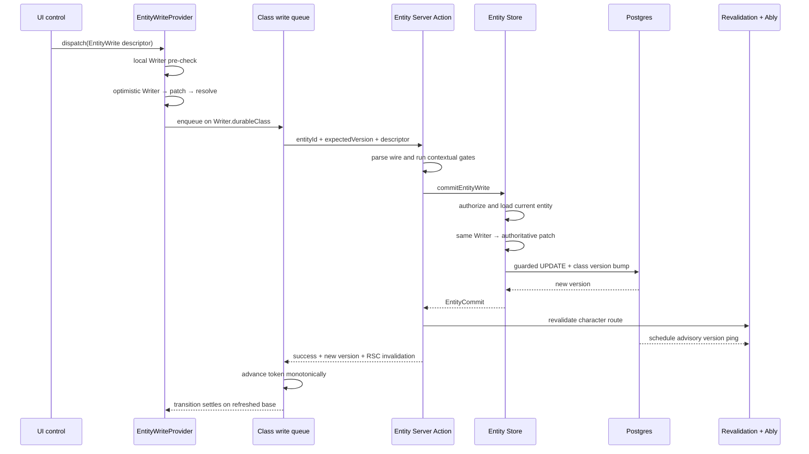
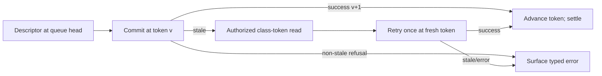

# Showtime's current entity read/write architecture

**Implementation snapshot:** 2026-07-20  
**Scope:** durable entity reads and writes from character routes, plus the combat
adapter that writes those same durable entities. Encounter/session and map
events are included only where they explain the entity seam.

## Executive answer

Showtime's durable entity module has a small external interface and substantial
implementation behind it:

- A route loads one authoritative entity row, parses its component columns into
  a runtime `Entity`, resolves derived game state, and passes the resulting
  `LoadedCharacter` through RSC.
- `EntityWriteProvider` owns the route's optimistic authored/resolved frame,
  four per-class version tokens, four tab-local serialization spines, and the
  realtime invalidation listener.
- UI controls dispatch storage-blind, serializable intent descriptors.
- One pure Writer registry turns a descriptor plus current components into a
  whole-component patch. The optimistic reducer and authoritative server Store
  call the same registry.
- The server re-derives identity, authorization, current state, version class,
  and patch. It commits with a guarded `UPDATE` that bumps exactly one version
  token.
- A successful write revalidates the RSC route and publishes an advisory Ably
  ping. The response reconciles the writer's own optimistic frame; pings cause
  other views to refetch through their existing read authorities.
- A shared queue protocol serializes same-class writes and retries one
  cross-writer stale result after fetching the current class token.

This is client-side prediction with server reconciliation, but it is not a
general sync engine. The optimistic log lives only for a React transition, the
queues and tokens live only in one tab, reads remain route/snapshot fetches, and
realtime messages carry invalidation metadata rather than row changes.

## Vocabulary

| Term            | Meaning in this architecture                                                                                            |
| --------------- | ----------------------------------------------------------------------------------------------------------------------- |
| Entity          | The game engine's runtime component bag, identified by entity id                                                        |
| Component       | One authored capability payload such as `vitals`, `equipment`, or `narrative`                                           |
| Resolved entity | Pure derived read units computed from authored components plus `ResolveContext`                                         |
| Descriptor      | A serializable intent from the `EntityWrite` discriminated union                                                        |
| Writer          | A storage-blind pure transition from current components plus one descriptor to a whole-component patch or typed refusal |
| Patch           | Whole replacement values for the components changed by one Writer; currently no Writer emits deletion                   |
| Store           | The server module that owns authorization, authoritative loading, Writer execution, and guarded commit                  |
| Door            | The Server Action boundary that parses a wire request and enters a Store                                                |
| Version class   | One of `identity`, `vitals`, `inventory`, or `progression`; a concurrency and authorization fact declared by a Writer   |
| Spine           | One promise chain that serializes writes sharing a version token inside one mounted client provider                     |
| Reconciliation  | Replacing/refolding the optimistic view when authoritative RSC or snapshot data arrives                                 |
| Ping            | Advisory realtime metadata saying an authoritative version advanced; never domain data or read authority                |

## Authorities and derivations

| Fact or decision                        | Authority                                                    | Derived representations                                                   |
| --------------------------------------- | ------------------------------------------------------------ | ------------------------------------------------------------------------- |
| Durable authored entity state           | `entity` row component columns                               | Runtime `Entity`, optimistic frame, resolved read units                   |
| Character ownership/lifecycle/placement | `playerCharacter` subtype row                                | `CharacterProfile`, authorization decisions                               |
| Component validity on load              | Game-v2 component schemas at `loadEntity`                    | Parsed runtime components or explicit load issues                         |
| Game transition semantics               | Game-v2 pure operations called by `ENTITY_WRITERS`           | Client prediction and server patch                                        |
| Serializable write vocabulary           | `entityWriteSchema`                                          | `EntityWrite` type and both entity/combat wires                           |
| Component-to-Writer pairing             | Exhaustive `applyEntityWrite` dispatch over `ENTITY_WRITERS` | One transition interface for client and server                            |
| Version class                           | Writer's `durableClass`                                      | Queue selection, token selection, SQL guard column, authorization posture |
| Storage home in combat                  | Server-loaded participant locator                            | Durable entity Store or inline session Store                              |
| Current version                         | Version column in authoritative row                          | RSC-seeded monotonic ref; successful results and pings only advance it    |
| Base rendered state                     | RSC/snapshot loader                                          | `useOptimistic` base; refetched after commits or pings                    |
| Realtime channel name and capability    | Server token route                                           | Subscribe-only Ably client connection                                     |

## Persistence shape

The `entity` table is a component-column projection:

- universal app/query metadata: `id`, `shortId`, `name`, `portraitUrl`,
  `pronouns`, `notes`, tombstone, and timestamps;
- one nullable JSONB column per durable engine component, with
  `NULL ⇔ component absent`;
- four integer version columns;
- no character kind, owner, campaign, status, or builder step—those belong to
  the `playerCharacter` subtype.

`name` and `portraitUrl` are lifted into runtime `identity` and `presentation`
components by the assemble seam. Every other non-null component column becomes
one entry in the runtime component bag.

The column-per-component shape is load-bearing for concurrency. Each version
class owns a disjoint set of component columns, so a vitals-class `UPDATE` cannot
overwrite an inventory-class component even when the writes race.

### Version classes and current Writer families

| Version class | Writer families                                                                       | Durable authorization                       |
| ------------- | ------------------------------------------------------------------------------------- | ------------------------------------------- |
| `identity`    | `path`, `talents`, `narrative`; app columns such as name/pronouns also serialize here | Entity owner                                |
| `vitals`      | `vitals`, `skillPool`, `resources`, `mechanics`, `rest`, `exhaustion`                 | Entity owner or the character's campaign DM |
| `inventory`   | `equipment`                                                                           | Entity owner                                |
| `progression` | `level`, `archetypes`, `virtues`                                                      | Entity owner                                |

The class is per edit surface, not mechanically per database column. For
example, all equipment and currency intents share the Inventory surface and
therefore the inventory token.

## Read path

```mermaid
flowchart LR
  ROUTE["RSC character route"] --> PC["load playerCharacter + entity row"]
  PC --> ASSEMBLE["entityRowToBag"]
  ASSEMBLE --> LOAD["game-v2 loadEntity<br/>parse component schemas"]
  LOAD --> RESOLVE["resolveEntity"]
  RESOLVE --> TRIPLE["LoadedCharacter<br/>profile + entity + resolved"]
  TRIPLE --> PROVIDER["EntityWriteProvider<br/>authoritative base"]
  PROVIDER --> UI["UI reads authored + resolved state"]
```



### Route load

`loadCharacterByShortId` is request-memoized with React `cache()` so layout and
page consumers share one database load. It:

1. fetches the live player-character subtype and entity row by public short id;
2. projects app-owned fields and the four version columns into
   `CharacterProfile`;
3. assembles non-null component columns plus lifted metadata;
4. parses the bag through the game-v2 load seam;
5. runs `resolveEntity` once; and
6. returns `{ profile, entity, resolved }`.

A missing/tombstoned short id returns no character. A malformed stored component
is a data-integrity failure: the loader logs its component issues and the route
does not render a partial entity.

### Authored versus resolved reads

Inside the client provider, `useLoadedCharacter` is the one surface read hook:

- authored choices come from `entity.components`;
- derived values come from `resolved`;
- app profile fields come from `profile`.

The provider reruns `resolveEntity` after every accepted optimistic patch using
the same `ResolveContext` that produced the base frame. That matters for derived
values whose result depends on encounter zone effects or party composition.
Context changes themselves remain route-owned: the provider does not invent a
new authoritative context.

### Read variants and tombstones

The lower entity queries make deletion behavior explicit by why the caller holds
an id:

- public identity/discovery reads and live occupancy/setup reads filter
  tombstones;
- persisted encounter locators may hydrate tombstones so an in-progress or
  historical encounter does not acquire a dangling durable participant.

This is a read-policy distinction, not a generic id-versus-short-id rule.

### Public fog reads

Fogged dungeon and encounter views do not receive authoritative storage rows.
The server loads full state and projects a redacted snapshot before it crosses
the process boundary. Ably only tells the public client to fetch that projection
again. This is why a whole-row client sync layer cannot replace the current read
path without a security redesign.

## Character-route write path



### 1. Descriptor construction

A control creates one `EntityWrite` descriptor. The wire expresses intent, not
storage shape and normally not aggregate post-state:

- `damage { amount }`, not “set HP to X”;
- add/remove one Talent, not a client-rebuilt list;
- add/remove currency by delta;
- update one narrative field or entry;
- carry a deterministic id seed when a transition creates rows.

The Zod union rejects malformed or out-of-range descriptors before the Store.
It intentionally carries no storage-home claim and no caller-supplied version
class.

### 2. Local prediction

`useEntityWrite` first calls `applyEntityWrite` against the current authored
components. A typed refusal does not create an optimistic lie or a request.

Inside one React transition, `applyLocal` sends the descriptor to reducer-form
`useOptimistic`. The reducer:

1. runs `applyEntityWrite` against the **current optimistic frame**;
2. merges the whole-component patch;
3. reruns `resolveEntity`; and
4. returns the new authored/resolved frame.

Reducer form is important. A burst of intents is replayed over the previous
optimistic result rather than each event closing over the same rendered base.

### 3. Class selection and serialization

The provider looks up `ENTITY_WRITERS[write.component].durableClass`. It owns one
monotonic version ref and one promise-chain ref for each of the four classes.

Writes in the same class serialize. A queued action reads its token only when it
reaches the head of the spine, after its predecessor has had a chance to return
and advance the token. Writes in different classes may run concurrently because
their SQL guards and column footprints are disjoint.

These queues are mounted-provider state. They are not durable, shared between
tabs, or global to the browser.

### 4. Entity door

`applyEntityWriteAction` parses `{ entityId, expectedVersion, write }`.

It owns the rare request-context gates that cannot live in the pure Writer. At
present, spending an Archetype rank is rechecked against the current viewer's
restricted-Archetype allowlist and the campaign's narrative gate.

The door then calls `commitEntityWrite` and, on success, revalidates the
character route. Level/Archetype changes additionally revalidate the character
list because they affect summary data.

### 5. Entity Store

`commitEntityWrite` is the durable module:

1. derive the Writer's version class;
2. run the class-appropriate authorization gate;
3. load and parse the current authoritative entity row;
4. run the same pure Writer against current components;
5. pass its patch to the guarded update; and
6. return the new class version, short id, and lifecycle status.

The server never trusts the client's optimistic patch. The wire contains only
the descriptor. This is the structural reason a stale client can safely retry an
intent such as “damage 2”: the server applies it to the row it just loaded.

### 6. Guarded update

`advanceEntityAxisGuarded` performs one conditional update inside a registered
mutation attempt or an approved stamped Store:

```text
UPDATE entity
SET <writer patch>, <classVersion> = <classVersion> + 1
WHERE id = <entityId> AND <classVersion> = <expectedVersion>
RETURNING <new classVersion>
```

If no row updates, the guard throws mutation contention so the authority can
rerun the whole handler against current state.

On success, the guard records the class axis and new revision on the attempt
stamp. The executor (or an approved external-commit finalizer) owns cache expiry
and invalidation publication; the guard publishes no entity data.

### 7. Own-write reconciliation

The successful Server Action invalidates the character layout. Next can include
the new RSC payload in the transition response, advancing the provider's
authoritative base as the optimistic action settles. This avoids a mandatory
client `router.refresh()` after every own write.

The success result separately advances the queue's class token immediately. The
later echo ping compares equal and is suppressed.

## Stale handling

The shared React-free queue core implements one protocol for every façade:

1. execute at the current token;
2. advance the token on success;
3. on `stale`, fetch the authoritative token for that entity and class;
4. advance the local token forward-only;
5. retry the same action once; and
6. surface a second `stale` as a real conflict.



The client refetches only the token, but the retried Server Action reloads the
whole authoritative entity and reruns the Writer. Token-only client refetch is
therefore correct for intent descriptors. It would be unsafe for a stale
client-composed aggregate post-state, which is why those payloads are avoided.

A stale that survives the retry causes the character route to toast and
`router.refresh()`. Debounced autosaves use the same one-pass retry helper but do
not enqueue recursively because their lifecycle is already chained on the class
spine.

## Realtime invalidation

Every guarded entity write schedules an Ably ping after the response/transaction
scope. The payload is:

- channel domain and server-resolved channel name;
- row-family tag (`entity` rather than the retired parallel character stream);
- the touched version class and new value.

`EntityWriteProvider` obtains a subscribe-only token from the server, lazily
loads the browser SDK, validates incoming payload shape, and advances only known
finite class versions. If any token is genuinely fresher, it calls
`router.refresh()`.

This gives:

- echo suppression for the current tab;
- cross-tab and DM/player invalidation;
- recovery refresh after an Ably reconnect; and
- a transport that cannot bypass read authorization because it contains no
  domain data.

If Ably is absent or unavailable, the entity provider stays usable but loses
push invalidation. Own Server Actions still revalidate their route; other tabs
catch up on later navigation/refresh, and a stale next write can self-heal through
the retry protocol. There is no polling fallback on ordinary character routes.

## App-owned column writes

Not every entity edit is a Writer descriptor.

`name`, `portraitUrl`, `pronouns`, and `notes` are app-owned columns. They use
focused Server Actions and compose with the same identity-class guard and queue.
The important rule is per-field server composition: a control submits the field
it intends to change, not a client-built replacement for unrelated fields.

Character lifecycle fields such as builder step, status, and campaign placement
live on the `playerCharacter` subtype and have their own actions. They are not
silently routed through component Writers.

## Combat's durable entity adapter

Combat uses the same descriptor and Writer registry for component writes, but
the participant's storage home is not knowable from the UI gesture alone.

### Client

`useCombatConsole` binds the complete encounter canon to one predicted
`showtime.combat.v1` root. Generic events, participant component writes, and end
intent all enter through `root.mutate`; the root owns ordering, optimistic
prediction, receipt settlement, and canon handoff. `useCombatantWrite` remains
storage-blind and submits only the participant id plus the domain write.

### Server

`applyCombatMutationAction` binds the three combat definitions to their
commands. The command reloads the encounter and reads the participant's
authoritative locator; the wire carries no storage claim. The server chooses:

- inline storage: Writer pre-validation, event minting, session reduction, and
  guarded encounter-blob save; or
- durable storage: the same composed `commitEntityWrite` Store used by
  character routes.

The authority owns receipt execution, contention retry, and accepted stamp
publication. Every changed encounter, Map Instance, dungeon, or durable entity
row records its storage axis in that attempt's stamp. A client's provisional
belief about storage can affect prediction only; it cannot reroute the
authoritative write or change its authorization gate.

## Error model

Expected failures use `Result` throughout the interface:

- boundary errors such as `invalid-input`;
- Writer refusals such as `capability-missing`, `rank-capped`, or
  `insufficient-victories`;
- storage errors such as `stale`, `entity-not-found`, and `entity-load-failed`;
- combat-router errors such as missing home-specific tokens or locators.

Authorization and framework navigation control flow still throw. Unexpected
transport or runtime failures are caught at the transition boundary and produce
generic save failure UI while React drops the optimistic action.

## Verification surface

The architecture is tested through several interfaces rather than one large
end-to-end test:

- descriptor schemas pin the admitted wire vocabulary and combat subset;
- Writer tests cover pure transition/refusal behavior;
- Store/action tests cover auth routing, guarded commits, revalidation, and
  error propagation;
- queue tests cover serialization, monotonic accounting, one-shot retry, and
  rejected-chain recovery;
- provider tests cover optimistic dispatch and stale recovery;
- combat lane tests cover per-home token envelopes and per-character queues;
- the patch laws prove identity, associativity, and merge compatibility;
- the optimistic isomorphism laws quantify across all Writer families:

```text
resolveEntity(mergeComponentPatch(E, Writer(E, write)), context)
  ==
resolveEntity(commit → reload, context)
```

The isomorphism suite also has a non-vacuity guard so a generator that produces
only refusals cannot pass, and it checks that no current Writer emits a component
deletion.

## Guarantees

The current module guarantees:

- server authority over identity, authorization, current state, routing, and
  commit;
- one serializable intent vocabulary for all durable component surfaces;
- the same pure Writer transition on client and server;
- optimistic replay over the current optimistic frame;
- whole-component patch/re-resolve parity across JSON round trips;
- per-class in-tab ordering;
- disjoint cross-class storage footprints;
- one automatic retry for a genuine cross-writer version race;
- monotonic local tokens;
- typed expected failures;
- no domain data on the realtime transport; and
- server-side fog projection before public data crosses the boundary.

## Deliberate limits and unresolved edges

The module does **not** currently provide:

- durable or long-offline writes;
- a persistent optimistic mutation log;
- a queue shared between tabs;
- automatic fine-grained query updates—reconciliation refreshes the owning RSC
  route;
- push catch-up on ordinary character routes when Ably is unavailable;
- a single universal queue—the four spines are deliberate independent
  concurrency classes;
- deletion patches from Writers. The client merge algebra supports explicit
  `undefined` deletion, but Drizzle's guarded `.set` skips `undefined`; a law
  currently enforces that no Writer reaches that disagreement.

There is also a meaningful distinction between “commit acknowledged” and
“authoritative projection visible” that the current public interface does not
name as one state. The accepted receipt and a later covering canon are separate
facts; the predicted root owns their handoff without extending the React Action
until coverage.

## Key implementation references

- [`domain/character/load.ts`](../../apps/web/domain/character/load.ts) — route
  load boundary and `LoadedCharacter`
- [`domain/game-v2/entity-row-to-bag.ts`](../../apps/web/domain/game-v2/entity-row-to-bag.ts)
  — entity-row assemble/load seam
- [`lib/db/schema/entity.ts`](../../apps/web/lib/db/schema/entity.ts) — component
  columns and version tokens
- [`domain/entity/commit/write.schema.ts`](../../apps/web/domain/entity/commit/write.schema.ts)
  — descriptor vocabulary
- [`domain/entity/commit/writers.ts`](../../apps/web/domain/entity/commit/writers.ts)
  — Writer registry and dispatch
- [`domain/entity/commit/merge-patch.ts`](../../apps/web/domain/entity/commit/merge-patch.ts)
  — optimistic patch algebra
- [`domain/entity/use-entity-write.tsx`](../../apps/web/domain/entity/use-entity-write.tsx)
  — provider and entity predicted-root mount
- [`domain/entity/use-entity-predictions.ts`](../../apps/web/domain/entity/use-entity-predictions.ts)
  — Headcanon entity root binding
- [`lib/actions/entity/mutations/apply.ts`](../../apps/web/lib/actions/entity/mutations/apply.ts)
  — generated entity mutation action
- [`lib/actions/entity/entity-row-store.ts`](../../apps/web/lib/actions/entity/entity-row-store.ts)
  — authoritative durable Store
- [`lib/actions/entity/version-guard.ts`](../../apps/web/lib/actions/entity/version-guard.ts)
  — conditional stamped commit
- [`lib/realtime/axis-invalidations.ts`](../../apps/web/lib/realtime/axis-invalidations.ts)
  — shared lazy axis transport and watch polling binding
- [`domain/combat/commit/protocol.ts`](../../apps/web/domain/combat/commit/protocol.ts)
  — combat event/write/end protocol and predictors
- [`lib/actions/combat/mutations/commands.ts`](../../apps/web/lib/actions/combat/mutations/commands.ts)
  — combat authority, storage-home selection, and multi-axis stamps
- [`lib/db/queries/load-dungeon-snapshot.ts`](../../apps/web/lib/db/queries/load-dungeon-snapshot.ts)
  — server-side fog projection shell
- [`domain/entity/commit/__laws__/isomorphism.laws.test.ts`](../../apps/web/domain/entity/commit/__laws__/isomorphism.laws.test.ts)
  — client/server round-trip law
