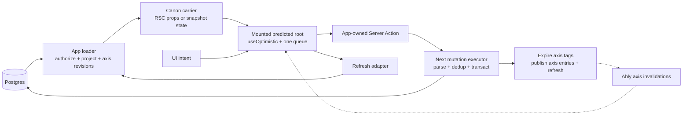

# Headcanon: optimistic mutations for React and Next.js

**Status:** Finalized spike design, revision 6<br>
**Date:** 2026-07-20<br>
**Package:** `@workspace/headcanon`<br>
**Supersedes:** the [earlier framework-independent proposal](./OLD-replica-module-design.md)

> **headcanon — optimistic mutations for Next.js: believe your writes until
> canon says otherwise.**

## Summary

Build an opinionated package for React applications using the Next.js 16+ App
Router. It provides the mutation half of Zero's model without `zero-cache`, a
client database, or a second read authority:

- The application delivers a complete, server-projected, versioned,
  serializable canon. RSC props are the default carrier; snapshot refetch is the
  second supported carrier.
- A client hook folds named deterministic mutations over that canon with
  reducer-form `useOptimistic`.
- A private lifecycle ledger records envelopes, delivery, receipts, and
  deferred milestones; it never becomes a second projected-state store or
  replay engine.
- The client sends intent and a stable mutation ID through a dedicated Server
  Action. It sends no expected revision.
- The authority loads current state, reruns the domain transition, and performs
  its guarded commit inside one transaction. A lost database race retries at
  the authority against newer state; it is not a client-visible stale protocol.
- Transactional receipts make redelivery after an ambiguous response
  effectively-once for database effects.
- Revisions are addressed by global storage-owned axes such as
  `entity/{id}/vitals` or `map-instance/{id}`. A mounted view observes axes; it
  does not own them.
- An accepted mutation returns a small revision vector naming every axis it
  advanced. One-row writes return a singleton vector; atomic multi-row writes
  return multiple entries.
- The executor mechanically expires the cache tag for every stamped axis and
  publishes one invalidation-only realtime entry per axis.
- A refresh adapter asks the application's existing read carrier for another
  complete canon. Realtime never supplies state.
- An observe-only root gives watch views the same invalidation, refresh, and
  stall machinery without a mutation interface.
- An optional package-owned polling fallback preserves watch liveness while
  realtime is unavailable.
- Pending mutations replay over every newer canon. An accepted mutation remains
  predicted until the mounted canon covers its entire accepted revision vector.

The package is deep because it decides the coordination model instead of asking
each application to rebuild it with callbacks. It is deliberately opinionated
about React, Next.js Server Actions, named intent, server-authoritative rebase,
one delivery queue per mounted view, global monotonic revision axes, vector
stamps, axis-derived cache tags, complete versioned canons, and
invalidation-only realtime.

It varies only at demonstrated seams:

1. application mutation semantics and authority policy;
2. the transactional authority ledger, initially Drizzle/Postgres plus an
   in-memory test adapter;
3. canon refresh, with router refresh and snapshot refetch adapters; and
4. invalidation delivery, initially Ably plus in-memory and no-realtime
   adapters.

This is not “Zero without `zero-cache`.” Removing `zero-cache` removes Zero's
reactive query engine, normalized client store, client groups, and replication
protocol. The proposed module steals the decisions that fit this application:
named intent, deterministic prediction, ordered delivery, durable mutation
identity, transactional deduplication, authoritative rebase, explicit
reconciliation milestones, and contract-tested adapters.

## Decision

Proceed with a bounded implementation spike, not a production migration or npm
release.

The spike should attempt to falsify this design through one end-to-end Next.js
fixture and three progressively harder Showtime bindings:

1. one entity on a character route;
2. the same entity axes observed and mutated from combat; and
3. one dungeon transaction that advances both dungeon and map-instance axes.

The design rests on three headline decisions.

### 1. Staleness is not a client protocol

The envelope contains no expected revision. The client never refetches a token,
folds a returned token forward, or retries a mutation against a fresh token.

The authority performs load → domain transition → guarded commit inside one
transaction. If the internal compare-and-swap loses a race, the executor retries
the whole transaction against current state under a bounded contention policy.
Whether the intent still means the same thing is decided by the intent itself:
generally replayable commands apply to current state, while preconditioned
commands carry and check the fact that gave them meaning.

This is the largest concrete simplification over Showtime's current write path.
It deletes the client-side stale protocol—the token refetch, forward-only bump,
one-shot retry, and “second stale is a real conflict” branch—and removes the
write-side reason for `version-token-store`.

### 2. Revision identity belongs to storage, not views

A revision axis is a globally addressed linear history tied to the storage fact
whose lifetime it describes. Showtime's pre-release hard cut now exposes only
opaque version-2 addresses:

```text
showtime:axis:v1:<sha256(canonical storage address)>
```

A character sheet, encounter console, dungeon console, or future party rail can
observe the same opaque entity-vitals axis. The canonical storage address stays
inside the factory; raw entity, encounter, and instance identifiers do not ride
axis cache tags, RSC revision vectors, channels, or invalidation payloads. No
package translation is needed between view-specific lane names because the axis
is not homed on the view.

An accepted stamp is a revision vector. A mutation that atomically advances two
rows returns both axes. Canonization requires the mounted canon to cover every
axis in that vector.

### 3. Reads arrive as complete versioned canons

The package never fetches or accepts pushed domain state. The application
delivers:

```ts
interface Canon<State> {
  value: State
  revisions: RevisionVector
}
```

RSC props are the default carrier. Existing snapshot refetch code is a second
carrier. The package receives only one refresh verb that asks the carrier to
produce another complete canon; it owns refresh coalescing, transition tracking,
and stall detection.

This keeps everything that made the old `ReplicaTransport` shallow—causal
ordering, cursors, watermarks, recovery snapshots, and partial-state folding—out
of the adapter interface.

## Context

Showtime already has the valuable part of Zero's mutation experience:

- controls emit serializable intent;
- pure Writers predict locally and execute again on authoritative state;
- reducer-form `useOptimistic` accumulates bursts correctly;
- guarded commits prevent accidental lost updates;
- Server Action revalidation reconciles route data; and
- Ably pings tell other views to refetch through their existing read authority.

The missing machinery is protocol quality rather than UI capability:

- a timeout after commit has no durable mutation identity to make retry safe;
- prediction, server acceptance, and authoritative canonization are not named
  separately;
- queue, retry, version, and refresh knowledge is spread across each binding;
- realtime observations can be confused with rendered authority;
- cache invalidation and realtime invalidation are decided in different homes;
- one storage revision receives different view-local addresses; and
- adapters are tested piecemeal instead of through behavioral contracts.

The first replica proposal correctly identified most of those problems. It
failed by making reads framework-independent. Its `ReplicaTransport.connect()`
required every adapter to produce a causally ordered stream of complete state
paired atomically with a cursor and per-client watermark. That did not remove
the read problem; it moved the problem into every adapter.

The first revision of this design corrected the read path but still scoped
revision lanes to mounted roots and coupled revision identity to delivery
ordering. That made cross-route entity writes and atomic dungeon writes look
exceptional. Revision 2 separated those concerns: storage owns axes, a canon
observes any number of them, a stamp can advance any small atomic set, and one
simple root queue owns delivery order.

## Goals

- Give a client caller one typed `mutate(invocation)` operation.
- Preserve immediate deterministic prediction with reducer-form
  `useOptimistic`.
- Keep application loaders and projectors as the sole authority for reads and
  redaction.
- Hide ordered delivery, mutation identity, ambiguous retry, rollback, rebase,
  cache invalidation, realtime invalidation, refresh coalescing, and projection
  catch-up.
- Remove expected revisions and stale retry from the client wire and client UI.
- Make authority-side duplicate delivery safe for transactional database work.
- Distinguish local prediction, authority acceptance, and projection catch-up.
- Keep mutation names and arguments as a stable, validated wire protocol.
- Allow authority behavior to be stricter than client prediction.
- Make replay semantics a property of mutation intent, not a queue option.
- Give each storage revision one globally stable address across all views.
- Support atomic multi-axis commits without introducing multi-root client
  coordination.
- Make axis cache invalidation and realtime publication one executor-owned
  success operation.
- Support RSC and snapshot refresh through one small, contract-tested seam.
- Keep mutating and watch-only views on one reconciliation architecture.
- Prove the interface in a second, unlike Next.js fixture before publishing it
  as stable.

## Non-goals

- A client database, normalized cache, query language, or reactive query engine.
- A framework-independent core as a product requirement.
- A generic read transport or a pushed accepted-state stream.
- Long-offline writes, reload-surviving pending mutations, background sync, or
  a browser outbox.
- Cross-tab mutation queues or Zero-style client groups.
- Parallel client delivery within one mounted view in version one.
- Coalescing, replacing, or rewriting queued envelopes. Autosave-style surfaces
  debounce and flush by calling `mutate` once; a queued envelope is never
  rewritten into newer intent under an existing mutation ID, which would break
  canonical receipt equality.
- CRDTs, field-level merge policies, or automatic semantic conflict resolution.
- Transactions across databases or authorities.
- Application authentication, authorization, domain rules, lock order, or
  redaction.
- Synchronizing hidden authority state so a redacted client can predict.
- Detecting arbitrary out-of-band SQL writes without CDC.
- Supporting every Drizzle dialect in the first version. The production
  authority adapter is Drizzle over Postgres.

## Terms

| Term               | Meaning in this design                                                                               |
| ------------------ | ---------------------------------------------------------------------------------------------------- |
| Mounted root       | One client lifetime and optimistic projection, such as a character provider or dungeon console       |
| Axis               | A globally identified monotonic revision line owned by storage, such as one entity version column    |
| Canon              | A complete server-projected value plus the revisions of every axis that value observes               |
| Headcanon          | A pending optimistic prediction: believed locally, but not yet ruled on by canon                     |
| Projection         | The current canon with every still-pending headcanon replayed in dispatch order                      |
| Lifecycle ledger   | Private mutation metadata for delivery and receipts; never a second projected-state store            |
| Mutation           | A stable name plus validated, serializable intent arguments                                          |
| Predictor          | The pure function that applies one mutation to client-visible state or returns a typed refusal       |
| Handler            | The authority-only function that authorizes, loads current state, applies domain rules, and commits  |
| Stamp              | The small revision vector naming every axis an accepted transaction advanced                         |
| Acceptance         | The authority's durable terminal outcome for a mutation ID                                           |
| Canonization       | Canon covers every axis and revision in an accepted stamp, so the corresponding headcanon can settle |
| Jossing            | Newer canon contradicts a headcanon during replay; the rejected prediction is jossed                 |
| Refresh adapter    | One verb that asks the application's carrier to deliver another complete canon                       |
| Invalidation       | Advisory axis revisions saying an observed canon may be stale; never domain state                    |
| Container axis     | A stable axis whose revision represents existence or membership of a dynamic projected set           |
| Uncertain delivery | A request whose response was lost, so the authority may or may not have committed it                 |

The thematic vocabulary names protocol states only where it is exact. Mechanical
operations keep descriptive names such as `covers`, `defineMutation`, and
`defineProtocol`; the package does not expose parallel themed aliases.

## Core types

Version one deliberately fixes revisions to non-negative safe integers. That
matches Showtime's Postgres version columns, makes ordering environment
independent, and avoids a comparator parameter at every binding.

```ts
type AxisId = string & { readonly __axisId: unique symbol }
type Revision = number & { readonly __revision: unique symbol }
type RevisionVector = Readonly<Record<AxisId, Revision>>

interface Canon<State> {
  value: State
  revisions: RevisionVector
}

interface AcceptedStamp {
  revisions: RevisionVector
}
```

Adapters reject negative, fractional, non-finite, or unsafe revisions. A future
decimal-string revision mode is a protocol-version decision, not a generic
parameter in version one.

Coverage is a product-order comparison:

```text
covers(canon, stamp) =
  for every (axis, acceptedRevision) in stamp:
    canon.revisions contains axis
    and canon.revisions[axis] >= acceptedRevision
```

A headcanon accepted with an empty no-op stamp is canonized immediately. Any
mutation that changes a client-visible projection must advance at least one axis
observed by that projection.

## Invariants

The package interface includes these rules, not only its TypeScript signatures:

1. A canon value and its complete observed revision vector come from one
   authoritative observation: one SQL statement, appropriate locks, or a
   transaction isolation level that preserves one snapshot across every query.
2. Each axis has one globally stable identity tied to the storage fact whose
   lifetime it describes.
3. Revisions are safe integers, losslessly serialized, and monotonically
   ordered within one axis.
4. A stamp names every axis whose revision the accepted transaction increments.
   A read-only guard advances no axis; there is no unstamped version bump.
5. Every axis in one stamp commits atomically with every other stamped axis and
   with the mutation receipt.
6. A headcanon is canonized exactly when the current canon covers every axis in
   its accepted stamp.
7. A mounted root from which a mutation can be invoked must carry every axis
   that mutation can advance, on every route or console where it mounts.
8. A predictor is pure and deterministic over its visible state and arguments.
9. Every authority execution parses the arguments again and derives trusted
   context, targets, storage home, and axes on the server.
10. The client sends no expected revision and receives no domain-level stale
    outcome.
11. A retry after uncertain delivery reuses the exact mutation ID and
    invocation.
12. Realtime payloads contain axis revisions only, never domain state.
13. Observing an invalidation revision does not advance the rendered canon
    revision.
14. Every cached canon is tagged mechanically from its observed axes; every
    accepted stamp expires those same tags before refresh or publication.
15. Every write that advances a protocol axis either uses the mutation executor
    or the explicit external-commit finalizer.
16. Authority handlers are transaction-rerunnable: they perform no effect
    outside the supplied transaction before terminal acceptance.
17. A canon observes every axis whose change can alter its projected value, not
    only axes its mounted root can mutate.
18. A query over the existence or membership of a dynamic set observes a stable
    container axis that advances when that set changes.
19. `useOptimistic` is the only mechanism that computes predicted domain state.
    The private lifecycle ledger may duplicate the canonical invocation needed
    for delivery, but it stores no second `State`, patch projection, or replay
    result.

Invariants 2, 4, 5, and 6 replace the earlier proposal's view-scoped lane plus
per-client canonization watermark. They are valid because each storage axis is
a linear history and a multi-axis stamp is the result of one database
transaction.

## Topology



The mutation response normally refreshes its caller. Ably improves catch-up for
other mounted views that observe any stamped axis. It is advisory: database
state and server projection remain correct when Ably is unavailable.

## Ownership

| Decision                             | Package                                                                                               | Application                                                                  |
| ------------------------------------ | ----------------------------------------------------------------------------------------------------- | ---------------------------------------------------------------------------- |
| Mutation naming and argument parsing | Registry machinery and wire envelope                                                                  | Names, schemas, compatibility policy                                         |
| Client prediction                    | Ordered replay, private lifecycle ledger, rollback, conflict recording                                | Pure predictor and domain error type                                         |
| Client delivery order                | One queue per mounted root                                                                            | Root lifetime only                                                           |
| Ambiguous delivery                   | Stable ID, retry, uncertain state                                                                     | UI retry affordance                                                          |
| Axis identity                        | Stable type, vector algebra, tag/channel derivation                                                   | Storage-owned axis namespace factories                                       |
| Authority deduplication              | Receipt protocol and Drizzle implementation                                                           | Database instance and migration adoption                                     |
| Authoritative mutation               | Executor lifecycle, contention retry                                                                  | Auth, policy, current-state load, domain handler, lock order, guarded commit |
| Canon delivery                       | Accept and reconcile complete versioned canons                                                        | Loader, projection, redaction, carrier                                       |
| Cache coherence                      | Axis-to-tag convention, tag helper, stamp invalidation                                                | Call loader helper; add unrelated route tags only when needed                |
| Refresh                              | Carrier grace, coalescing, transition tracking, fallback, stall detection                             | Select router or snapshot adapter                                            |
| Realtime                             | Axis-entry schema, subscriptions, monotonic comparison, capability refresh, optional polling fallback | Ably credentials, token issuance, viewer policy, polling interval            |
| Next control flow                    | Preserve framework navigation/auth signals before classifying transport failure                       | UI presentation for ordinary rejected requests                               |
| UI error policy                      | Honest lifecycle state and typed outcomes                                                             | Toasts, inline messages, retry controls                                      |

There is intentionally no generic database repository and no generic read
transport. Drizzle varies the transactional receipt ledger. Application
handlers continue to use Drizzle directly because table shape, authorization,
domain writes, and multi-row lock order are application knowledge.

## Package shape

The private workspace package is `@workspace/headcanon`.

```text
packages/headcanon/
  src/
    index.ts              # definitions, envelopes, axes, vectors, shared types
    react.ts              # predicted root, one queue, canonization state machine
    refresh.ts            # refresh seam, snapshot adapter, polling fallback
    next/client.ts        # router refresh adapter
    next/server.ts        # executor finalization, cache tags, external commits
    drizzle.ts            # Postgres receipt table + transactional adapter
    ably/client.ts        # axis invalidation subscriptions
    ably/server.ts        # axis invalidation publisher
    canonical-json.ts     # environment-independent invocation canonicalization
    testing.ts            # in-memory adapters and contract suites
```

The source graph must keep server-only dependencies out of the client bundle.
Shared mutation definitions contain schemas and pure predictors; they do not
import database clients, Node crypto, secrets, or server handlers.

The package should not expose queue operations, optimistic-log mutations,
receipt-table operations, cache-tag construction, or refresh-generation state
as daily caller interfaces. Those are internal seams exercised by the package's
own tests.

## Proposed interface

The types below communicate intended depth; exact spellings remain subject to
the spike.

### Mutation definitions

```ts
const entityWrite = defineMutation({
  name: "entity.write",
  args: entityWriteArgsSchema,
  predict(canon, args) {
    return applyAndResolveEntityWrite(canon, args.write)
  },
})

export const entityProtocol = defineProtocol({
  id: "showtime.entity.v1",
  mutations: [entityWrite],
})
```

`defineMutation` returns an invocation factory:

```ts
entityWrite({
  entityId,
  write: damage({ amount: 2 }),
})
```

The protocol decides three consequential facts once:

- the stable serialized name;
- the Standard Schema-compatible argument parser; and
- the deterministic client predictor.

There is no client lane or expected revision. The invocation contains intent
and the identifiers needed to resolve its target. The authority derives the
actual storage home and accepted axes from current trusted state.

The predictor returns the entire client-visible value. Showtime's binding can
keep its internal whole-component patch algebra, but the package should not make
every consumer learn a generic patch interface.

### Versioned canons and global axes

A character route might deliver:

```tsx
const canon = defineCanon({
  value: character,
  revisions: {
    [entityIdentityAxis(character.id)]: character.identityVersion,
    [entityVitalsAxis(character.id)]: character.vitalsVersion,
    [entityInventoryAxis(character.id)]: character.inventoryVersion,
    [entityProgressionAxis(character.id)]: character.progressionVersion,
  },
})

return <EntityProvider canon={canon}>{children}</EntityProvider>
```

The combat console's implemented P3a canon includes its encounter and
map-instance axes plus all four global entity axes for every durable participant,
whether or not that root can mutate the participant. The directly addressed
encounter axis is the roster's stable container dependency; the view does not
also claim the map-instance encounter-membership axis. Encounter, instance,
campaign authorization, participant hydration, and drawer-slice reads share one
read-only `REPEATABLE READ` transaction. The dungeon
console includes both its dungeon and map-instance axes plus every other axis
on which its projection depends. These are loader contracts, not client routing
decisions.

Axis factories live with the storage model and are imported by loaders and
handlers. The package treats their results as opaque stable strings.

For a multi-axis canon, “one authoritative observation” means one SQL statement,
appropriate row locking, or a transaction isolation level that guarantees one
snapshot across every projection query. PostgreSQL's default Read Committed
isolation does not satisfy this merely by wrapping several `SELECT`s in a
transaction: successive statements may see different committed snapshots.
Independently awaited queries have the same problem.

The default mechanism for a multi-query loader is a read-only `REPEATABLE READ`
transaction: every statement shares one snapshot, and a transaction that writes
nothing cannot fail with a serialization error, so no retry handling is
required.

The revision vector describes all projection dependencies, not only writable
targets. Dynamic sets also need an already-observable container axis. For
example, a view with no current encounter cannot observe an encounter row that
does not exist; it observes a dungeon, map-instance, or dedicated membership
axis that advances when the live encounter appears, disappears, or changes.
Roster and placement queries follow the same rule.

Vector construction belongs in the authoritative query/projector module. A
small package collector may accumulate `(axis, revision)` pairs from the exact
rows used during projection, but route components must not maintain parallel
dependency manifests. The collector is a convenience inside the loader, not a
new read adapter.

### Cached loader helper

When a Next.js loader uses Cache Components, it opts into the axis convention
with one helper:

```ts
async function loadCachedCharacter(shortId: string) {
  "use cache"

  const canon = await loadCharacterCanon(shortId)
  return tagVersionedBase(canon)
}
```

`tagVersionedBase` applies one package-derived `cacheTag` for every axis in
`canon.revisions` and returns the canon unchanged. `axisCacheTag(axis)` is a
bounded, versioned SHA-256-based tag, so raw identifiers cannot exceed Next's
tag limit or collide through ad hoc string conventions.

The helper calls `cacheTag` once and rejects a cached canon with more than 128
observed axes. Next currently drops tags after the 128th in one call, which
would silently break the coherence invariant. The spike must measure combat
canons against this ceiling; it does not split calls or invent grouped tags
without evidence that their invalidation semantics remain sound.

These forms were verified against the pinned Next.js 16.1.6 declarations:
`cacheTag(...tags)`, `updateTag(tag)`, and server `refresh()` are imported from
`next/cache`; the non-Action path uses
`revalidateTag(tag, { expire: 0 })`. The context split is therefore represented
in the package API rather than hidden behind one configurable invalidator.

An uncached loader uses `defineCanon` and needs no tag. The same canon
shape crosses both paths.

### Refresh seam

```ts
interface RefreshAdapter {
  readonly acceptanceGraceMs: number
  request(): void | Promise<void>
}
```

The adapter does not return state. It asks the existing carrier to deliver a
new complete canon; the package observes that canon through the same `canon` input.

Two adapters ship in version one, with carrier-specific acceptance grace:

- `useRouterRefresh()` calls `router.refresh()` for an RSC carrier and declares
  250 ms grace for the Action's own RSC payload to arrive; and
- `useSnapshotRefresh(refetch)` awaits an existing snapshot fetch that updates
  the caller's snapshot state and declares zero grace because no Action payload
  can update that state.

The package invokes either adapter inside its own React transition. React 19
entangles pending state across overlapping async Actions, so that transition's
pending flag is not operation-local completion evidence. A promise-returning
adapter owns its completion; a void adapter completes when the carrier next
delivers canon through the root input. Coverage is checked only after that
carrier-specific completion signal.

### React binding

An application configures a mounted-root family once in a client-only module:

```ts
export const useEntityPredictions = createPredictedRoot({
  protocol: entityProtocol,
  send: deliverEntityMutation,
  refresh: useRouterRefresh,
  invalidations: entityAxisInvalidations,
})
```

`deliverEntityMutation` is an application-owned client adapter. It calls the
raw Server Action but rethrows Next framework control-flow signals before the
package classifies an ordinary throw as uncertain delivery.

A domain provider supplies only its current canon:

```ts
const predicted = useEntityPredictions({ canon })
const result = predicted.mutate(entityWrite({ entityId, write }))
```

The returned interface is intentionally small:

```ts
interface PredictedRoot<State, Invocation, Error> {
  value: State
  mutate(invocation: Invocation): Result<MutationReceipt<Error>, Error>
  retryDelivery(): void
  retryRefresh(): void
  status: {
    pending: number
    delivery: "idle" | "sending" | "uncertain"
    freshness: "current" | "grace" | "refreshing" | "stalled"
    invalidations:
      | "disabled"
      | "active"
      | "reauthorizing"
      | "polling"
      | "unavailable"
    missingAxes: readonly AxisId[]
  }
  conflicts: readonly ReplayConflict<Error>[]
}

type MutationLifecycleError<Error> =
  | { kind: "domain"; error: Error }
  | { kind: "replay-refused"; error: Error }
  | { kind: "delivery-cancelled" }
  | { kind: "root-unmounted"; outcome: "unknown" | "accepted" }

interface MutationReceipt<Error> {
  id: string
  accepted: Promise<Result<AcceptedStamp, MutationLifecycleError<Error>>>
  canonized: Promise<Result<void, MutationLifecycleError<Error>>>
}
```

`mutate` runs a synchronous predictor pre-check. A local refusal returns
immediately and allocates no ID. A locally accepted mutation receives a random
opaque ID, enters reducer-form `useOptimistic`, and joins the root's one ordered
delivery queue.

Two `mutate` calls in one event pre-check against the same rendered projection.
If the second intent becomes invalid only after the first optimistic update,
the pure reducer reports that refusal during replay; the never-sent second
envelope is jossed with `replay-refused`. Computing a synchronous shadow
projection for the second pre-check would violate invariant 19.

The package also records that mutation in a private lifecycle ledger keyed by
mutation ID. The ledger contains the canonical envelope, delivery state,
accepted stamp or rejection, retry metadata, and the `accepted` and
`canonized` deferreds. It does not contain a second projected `State`, a
patch projection, or another reducer. React remains the sole owner of the
predicted domain value.

Each optimistic mutation has its own Action, and the Action's lifetime is the
mutation's **actively progressing delivery** — queued behind a progressing
head, sending, or inside the bounded automatic-redelivery backoff. It settles
at the terminal acceptance or rejection, at a preserved Next control-flow
signal, when the queue pauses on an unbounded-uncertain head, or on unmount.
It is **never held for canonization**. The original design held each Action
open until coverage; UNN-682 falsified that against the real App Router.
React entangles all transition-lane work — a Server Action's revalidated RSC
payload, `router.refresh()`, and navigations — with every pending Action and
commits none of it until all of them settle, so an Action awaiting coverage
blocks the very commit that could deliver its covering canon (and freezes
navigation for as long as it waits). The physics, established by
`apps/headcanon-fixture`'s probe suite: a payload produced while an Action is
open is parked, wherever the send was dispatched from, and flushes atomically
in the commit that settles the last pending Action.

That atomic flush is also what preserves the visible handoff on the RSC
carrier: the acceptance payload carrying the covering canon commits in the
same render that reverts the settled prediction, so the value flips from
predicted to authoritative with no canon-without-prediction frame. When the
committed canon does not yet cover (a stale cached loader, a snapshot carrier
awaiting its refetch), the prediction's continued visibility rests on React
retaining settled optimistic updates in its replay queue — retention the
package treats as best-effort, not a contract.

Rendered coverage therefore depends only on lifecycle facts, never on Action
settlement timing or React's retention timing. The root keeps acceptance
state — a map from mutation ID to accepted vector, updated outside render —
plus the refused and paused ID sets, and feeds them into the pure replay
frame alongside the rendering canon. Replay is idempotent per mutation ID
(React may hold an original update and its resume-time re-add
simultaneously), an update whose accepted vector the rendering canon covers
reduces to identity in the first covering render (so A is never applied
twice while B keeps it replayed), a paused update reduces to identity (a
paused root renders canon truth), and canonization is pure bookkeeping: the
coordinator resolves `canonized` and drops the ledger entry.

The optimistic reducer remains pure. It may return an internal replay frame
containing `value` and refused mutation IDs, but it never mutates the lifecycle
ledger, cancels delivery, resolves promises, or records conflicts during
render. After React commits the frame, the coordinator reconciles refusals into
the ledger before scheduling another unsent delivery.

`createObservedRoot` is the zero-mutation specialization of the same module. It
uses an empty registry and exposes only `value`, freshness and invalidation
status, and `retryRefresh`; it has no `mutate`, delivery status, or conflicts at
the caller interface. Internally it reuses axis subscriptions, monotonic
invalidation comparison, refresh coalescing, transition tracking, and stall
detection. This keeps watch-only views on the same reconciliation architecture
without making an unusable mutation operation part of their interface.

### Server Action binding

The actual Server Action remains an application-owned async function in a
module-level `"use server"` file. Authentication has a clear home there, and
Next.js can statically identify the exported server function.

```ts
"use server"

const execute = createNextMutationAction({
  protocol: entityProtocol,
  actor: requireActor,
  authority: createDrizzleMutationAuthority({ db, scope: actorScope }),
  commands: [
    bindMutation(entityWrite, entityWriteCommand),
    bindMutation(entityIdentity, entityIdentityCommand),
    bindMutation(entityFinalize, entityFinalizeCommand),
  ],
  invalidations,
  reportInvalidationFailure,
})

export async function applyEntityMutationAction(envelope: unknown) {
  return execute(envelope)
}
```

The action expires stamped axis tags, publishes one singleton entry per stamped
axis, and asks Next to refresh the current route. A command's repeat-safe
`afterAccepted` hook owns genuinely additional projections such as a summary
list that does not observe the mutated axis directly.

The package's Next client binding also owns thrown-request classification. It
uses Next's `unstable_rethrow` before converting an ordinary Server Action or
network rejection into `delivery: "uncertain"`, so `redirect`, `notFound`,
`forbidden`, `unauthorized`, and other framework control-flow signals retain
their framework behavior. A control-flow cancellation settles both mutation
receipts with `delivery-cancelled` and removes the ledger entry before the
signal propagates. `guard-write-transition.ts` does not remain as an application
synchronization helper.

### Mutation command action

```ts
const executeEntityMutation = createNextMutationAction({
  protocol: entityProtocol,
  actor: requireActor,
  authority: createDrizzleMutationAuthority({ db, scope: actorScope }),
  commands: [bindMutation(entityWrite, entityWriteCommand)],
  invalidations: createAblyInvalidationPublisher({ ably }),
  reportInvalidationFailure: recordInvalidationFailure,
})
```

Bindings are exhaustive over the protocol's mutation definitions. Each command
owns fail-closed admission, transaction execution, and optional repeat-safe
accepted projections. Transaction admission receives the adapter's current
transaction, parsed arguments, trusted actor, and an attempt-local stamp
accumulator. It returns a typed decision; the package constructs the accepted
vector from every recorded advance rather than trusting a hand-built return
object:

```ts
const entityWriteCommand = {
  async admit({ executor, actor, args }) {
    const admitted = await admitEntityWrite(executor, actor, args)
    return admitted.ok ? allowMutation(admitted.value) : denyMutation()
  },
  async execute({ tx, args, evidence, stamp }) {
    const committed = await commitAdmittedEntityWrite(
      tx,
      args,
      evidence,
      stamp
    )
    return committed.ok
      ? acceptMutation()
      : refuseMutation(committed.error)
  },
  afterAccepted: projectAcceptedEntityWrite,
} satisfies MutationCommand<...>
```

The package never accepts a client-composed patch, expected revision,
client-derived axis, actor identity, or storage-home claim as authority.

## Server-authoritative rebase

### Why the client token was the wrong proof

The current entity wire's `expectedVersion` proves only that the row has not
changed since the client rendered. It does not prove that a replayable intent is
still meaningful. “Apply two damage,” “add this item,” and “spend one currency”
are deliberately defined against the state at execution time.

Conversely, a lifecycle command can become invalid even if unrelated state
changed without touching its old client token. Meaning preservation belongs in
the command's explicit preconditions and domain operation, not in a generic
render-time equality check.

Therefore version tokens have one client role in the new design: they are read
evidence for canonization and invalidation comparison. They are not write
credentials.

### Authority algorithm

For a new mutation ID, the authority adapter performs at most two immediate
transaction attempts by default: the initial attempt plus one contention retry.

Each attempt:

1. begins an outer transaction and claims or locks the mutation receipt
   identity;
2. starts an attempt savepoint and an empty attempt-local stamp accumulator;
3. loads the current authoritative rows inside that savepoint;
4. authorizes contextual policy using current trusted facts;
5. runs the registered command against that state;
6. applies application-owned lock order for multi-row commands;
7. performs guarded writes using only revisions read inside this attempt and
   records every successful version advance in the accumulator;
8. on acceptance, retains the savepoint work, records its accumulated vector,
   and commits domain effects plus receipt atomically; or
9. on terminal typed rejection, rolls back the attempt savepoint, records the
   rejection in the still-active outer receipt transaction, and commits only
   that receipt.

If a guarded write loses a race, the attempt rolls back without a receipt and
the authority adapter reruns the command against newer state. If the second
attempt also loses, it returns a retryable contention classification without a
terminal receipt. The client later redelivers the same envelope and mutation ID;
it does not fetch or send a version.

Commands must therefore be rerunnable. Before terminal acceptance they may
produce effects only through the supplied database transaction; Ably publishes,
Blob writes, email, and other external work belong in post-acceptance
finalization or a transactional outbox. A lost compare-and-swap can invoke a
command twice even though redelivery later remains effectively-once.

Commands also never throw framework control flow. A mutation's outcomes are
typed values; the package action translates denial to `forbidden()` outside the
transaction, and navigation after acceptance is a caller UI decision.

Existing multi-row helpers must expose transaction-neutral bodies that accept
the supplied transaction. `guardMany` cannot continue to own another outer
transaction inside a protocol command, and the migration must not create
parallel `commitX` and `commitXInPredictedTransaction` variants. Drizzle's
nested-transaction support supplies the savepoint; domain lock order remains
application-owned inside it.

A preconditioned command may return a terminal domain conflict on the newer
state. A generally replayable command simply produces the transition that its
intent describes. The application never receives a generic `stale` result.

### Concrete deletions from Showtime

Once a binding fully migrates, the package replaces the write-side
responsibilities of:

- `write-queue.ts` token reads, forward-only bumps, stale refetch, and one-shot
  retry;
- `version-token-store.ts` write coordination;
- `use-monotonic-version-ref.ts` write coordination;
- per-class or dual-lane client spines; and
- `run-dual-versioned-write.ts` client token composition.

The server keeps guarded writes. Their purpose changes from enforcing a client
snapshot precondition to detecting a race within an authoritative transaction
attempt.

## Mutation lifecycle

### 1. Predict

1. Parse the invocation locally through its registered schema.
2. Run the predictor against the current projection.
3. If it refuses, return the typed error without allocating protocol state.
4. Allocate a cryptographically random mutation ID.
5. Add the invocation to reducer-form `useOptimistic`.
6. Append its envelope to the mounted root's delivery queue.

Back-to-back actions fold over the projection produced by prior pending actions,
not over the canon captured by an event handler.

### 2. Deliver in root order

```ts
interface MutationEnvelope<Invocation> {
  protocol: string
  mutationId: string
  invocation: Invocation
}
```

One mounted root delivers one envelope at a time. This preserves optimistic and
authoritative intent order and gives ambiguous delivery one simple blocking
rule: an uncertain head pauses later mutations from that root.

Revision axes do not participate in delivery scheduling. Next.js currently
dispatches and awaits client-invoked Server Functions one at a time anyway, so
per-axis scheduler independence would add interface and contract weight without
reliable wire parallelism. Cross-root calls may still be serialized by Next's
current implementation; the package promises order, not parallel throughput.

Where the send is dispatched from is irrelevant to payload delivery (UNN-682):
a Server Action invoked from the coordinator's effect and one invoked inside
the owning Action produce the same parked payload, which commits only when
every pending Action settles. The queue therefore keeps its effect-driven
pump; what canonization requires is Action settlement at acceptance, not
send-inside-Action scope.

### 3. Execute and record

The action and authority adapter:

1. validates the protocol, mutation ID, mutation name, and arguments;
2. computes an environment-independent canonical invocation;
3. performs preflight admission, then enters the Drizzle authority transaction;
4. looks up the receipt by trusted actor scope and mutation ID;
5. rejects reuse of an ID with different canonical bytes;
6. returns the recorded outcome for an exact duplicate;
7. otherwise reruns command admission and execution against current authority;
8. records the accepted vector or typed rejection atomically with domain work.

Unexpected exceptions and exhausted internal contention abort without a
terminal receipt.

### 4. Finalize accepted axes

After a new or duplicate acceptance commits, the Next action performs one
package-owned finalization sequence:

1. call `updateTag(axisCacheTag(axis))` for every stamped axis;
2. call Next's server-side `refresh()` for the invoking route;
3. make one timeout-bounded publication attempt with one entry per stamped
   axis, sharing one event ID; and
4. return the recorded accepted stamp.

`updateTag`, rather than stale-while-revalidate `revalidateTag(..., "max")`, is
intentional: a mutation needs read-your-own-writes, so the next request must wait
for fresh cached data instead of being served the old canon.

This makes `createNextMutationAction` a Server Action-only module. Next.js
permits `updateTag` only in that context. A Route Handler or background job must
use the separately named external-commit path; the action must not silently
pretend both contexts have an invoking route to refresh.

An Ably failure is advisory and does not turn an accepted database transaction
into a rejection. Publication is timeout-bounded and recorded. Duplicate
redelivery repeats finalization from the recorded stamp, which can heal a
publication missed around an ambiguous response without rerunning the command.

### 5. Accept

When the client receives the recorded vector, `receipt.accepted` resolves. The
trusted terminal acceptance settles the mutation's optimistic Action and
releases the delivery queue so the next intent can execute (UNN-682: settling
here is what lets the parked RSC payload commit — the covering canon and the
prediction's revert land in one atomic flush, so the prediction visibly hands
off to the authoritative value rather than flickering). A typed rejection also
releases the queue, settles that optimistic action, and replays all later
pending mutations over the unchanged canon. Only uncertain delivery, not
projection catch-up, blocks the queue — and a queue paused on an
unbounded-uncertain head settles every held Action and renders canon truth,
because a held Action would freeze canon delivery and navigation for as long
as the retry affordance sits unused. The envelopes and mutation IDs stay in
the ledger; a manual retry re-opens the Actions and re-mounts the paused
predictions for the duration of the attempt.

Acceptance also merges the accepted vector into the root's observed-invalidation
metadata. The write's own Ably echo then compares non-fresher and schedules no
refresh; echo suppression falls out of the ordinary comparison rule rather than
being a special case.

### 6. Canonize

On every new canon, the package:

1. replaces the old authoritative value and observed revision vector;
2. resolves accepted mutations whose entire vectors are covered (their
   Actions settled at acceptance — UNN-682); and
3. atomically replays all remaining actions over the new canon.

`receipt.canonized` resolves only after step 2. This is distinct from
acceptance even when a Server Action response normally carries both close
together.

If replay refuses a mutation whose envelope has never been sent, the package
cancels that envelope, removes its prediction, records a `ReplayConflict`, and
settles both receipt promises with `replay-refused`. If delivery is already
sending or uncertain, it cannot be retracted: the local predicted effect is
removed, but the authority's eventual terminal outcome remains decisive.

### 7. Reconcile another writer

An invalidation entry contains one axis revision:

```ts
interface AxisInvalidation {
  eventId: string
  axis: AxisId
  revision: Revision
}
```

A mounted root ignores axes its canon does not observe. If the entry's revision
is newer than both its canon and last observed invalidation for that axis, it
merges the observation forward and requests a coalesced refresh.

Observed revisions are refresh-deduplication metadata. They never advance the
canon, prove canonization, or become write tokens.

## Canonization and refresh state machine

The original design held each optimistic Action open until its accepted
vector was visible and named that the riskiest React mechanic in the design.
The risk fired (UNN-682): a held Action entangles and blocks the very
transition commits that deliver canon, so a mounted RSC root could never
canonize. Actions now settle at terminal acceptance (see React binding); this
state machine is unchanged in shape but runs against canons that arrive in
the settlement flush or through the refresh seam afterwards.

### States

```mermaid
stateDiagram-v2
  [*] --> Current
  Current --> Grace: RSC acceptance not covered
  Current --> Refreshing: snapshot acceptance not covered
  Current --> Refreshing: fresher external invalidation
  Grace --> Current: canon covers stamp
  Grace --> Refreshing: 250 ms without coverage
  Refreshing --> Current: refreshed canon covers requirements
  Refreshing --> Refreshing: completed uncovered; one retry remains
  Refreshing --> Stalled: two completed refreshes still uncovered
  Stalled --> Current: later canon covers requirements
  Stalled --> Refreshing: retryRefresh or new fresher invalidation
```



### Rules

- An accepted-but-uncovered stamp uses its carrier's declared grace. The RSC
  adapter waits 250 ms so the normal Server Action payload can land without
  another request. The snapshot adapter declares zero and refreshes
  immediately because an Action payload cannot update client snapshot state.
- A fresher external invalidation skips grace and requests refresh immediately.
- There is at most one refresh transition in flight per mounted root.
- The refresh coordinator uses a dedicated `useTransition`, separate from the
  transitions held open for optimistic Actions, and wraps
  `refresh.request()` in that transition for scheduling. It does not use the
  transition's entangled pending flag as operation-local completion evidence.
- For router refresh, `router.refresh()` returns no promise, so completion means
  that the carrier delivered a new canon input after the request began.
- For snapshot refresh, the adapter's promise is the completion signal. A
  synchronous snapshot adapter follows the same next-canon rule as any void
  carrier.
- On refresh completion, the package checks the newest delivered canon; adapter
  completion alone never proves freshness.
- If requirements remain uncovered, the package waits one second and performs
  one final coalesced refresh.
- After two completed refreshes without coverage, freshness becomes `stalled`.
- Accepted-but-uncovered predictions stay in React's optimistic replay queue
  on a best-effort retention basis while stalled (their Actions settled at
  acceptance — UNN-682). Their canonization promises remain pending because
  acceptance is known but projection catch-up is not.
- `retryRefresh()` or a genuinely fresher invalidation resets the two-attempt
  budget.
- Unmounting resolves unsettled receipt promises with `root-unmounted`, records
  whether authority acceptance was already known, and releases every deferred
  transition. It cannot undo a commit that may already be in flight. A later
  mount starts from its newly loaded canon.

`stalled` reports why coverage failed:

- `behind`: every required axis exists but at least one revision is too old;
- `missing-axis`: the accepted stamp names an axis absent from the mounted
  canon; or
- `refresh-error`: the adapter itself failed twice.

`missing-axis` is normally a loader contract defect, not a transient network
state.

### Projection and canonization loader contract

Every canon observes all axes whose changes can alter its projected value. A
canon from which a mutation can be invoked additionally observes every axis that
the authority may stamp for that mutation:

- a character sheet carries its entity's four axes;
- an encounter console that can mutate a durable participant carries that
  participant's entity axis;
- a dungeon console that can commit dungeon + instance work carries both axes;
  and
- a route that can advance dungeon + region carries both axes.

A view that projects a dynamic set also carries its stable container axis even
when the set is empty. Dynamic member axes describe changes to existing
members; the container axis announces additions, removals, and changes in which
member exists.

The rule is mechanical: every revision increment is stamped, cache-expired, and
published. A row used only as a lock or precondition may be read and guarded
without incrementing its revision; if its revision is incremented, it is no
longer “only” a guard and must appear in the accepted stamp.

The value can remain safely projected and redacted. Carrying a revision does not
authorize or reveal the row's domain state. If even the existence of an axis is
sensitive, the application uses an opaque axis ID from its storage namespace.

## Cache coherence by construction

The global axis is also the Single Choice for cache invalidation:

```text
storage axis
  -> package cache tag
  -> cached canons that observe the axis
  -> executor updateTag on accepted stamp
  -> other-view refresh after invalidation
```

The loader knows which axes its value observes, so `tagVersionedBase` tags them.
The handler knows which axes it advanced, so its accepted stamp invalidates the
same derived tags. No action wrapper maintains a parallel list of core cache
keys.

The wrapper may still invalidate unrelated projections that intentionally do
not observe those axes—for example a search index or aggregate list whose own
revision is not yet modeled. That is additional application knowledge, not a
second home for axis coherence.

The Phase 0 fixture includes a deliberately mis-cached loader that omits
`tagVersionedBase`. The test must show:

1. the mutation is accepted;
2. both automatic refresh attempts reproduce the old cached canon;
3. the prediction remains mounted;
4. freshness becomes `stalled`; and
5. adding the helper makes the same story canonize.

This negative control proves both that the invariant can fail and that the
package detects the failure honestly.

## Ambiguous delivery and idempotency

A thrown or lost Server Action response is not a domain rejection. The authority
may have committed immediately before the connection failed.

The package therefore:

1. preserves the prediction;
2. retains the exact canonical envelope;
3. reports `delivery: "uncertain"` after the request retry budget;
4. pauses later mutations in that mounted root;
5. retries with the same mutation ID when connectivity recovers or the caller
   calls `retryDelivery()`; and
6. accepts the receipt table's recorded terminal outcome.

It never allocates a replacement ID or turns retry exhaustion into a domain
rejection.

The guarantee is **effectively-once transactional authority effect**, not magic
exactly-once networking:

- a successfully recorded ID executes its database effect at most once;
- continued redelivery can recover the same terminal outcome;
- only database work performed through the authority transaction is covered;
- email, storage, vendor calls, and other external effects need their own
  idempotency or a transactional outbox; and
- a page reload discards an uncommitted in-memory intent in version one.

## Canonical invocation equality

Receipt equality must not depend on object insertion order, runtime-specific
JSON output, locale sorting, or a lossy hash input.

After Standard Schema parsing, the executor canonicalizes this JSON value:

```ts
{
  protocol,
  invocation,
}
```

Version one uses RFC 8785 JSON Canonicalization Scheme semantics:

- object keys are recursively ordered by the standard's UTF-16 code-unit rules;
- array order is preserved;
- strings and numbers use the canonical JSON representations;
- `undefined`, functions, symbols, non-finite numbers, `bigint`, cyclic values,
  and class instances are rejected before receipt lookup; and
- the canonical UTF-8 bytes are identical in every supported environment.

The receipt stores the canonical JSON and a SHA-256 fingerprint. The fingerprint
supports indexed lookup and diagnostics; exact canonical-byte equality decides
whether an existing mutation ID was honestly redelivered. Same ID plus different
bytes fails closed as protocol misuse.

Contract tests include differently ordered object keys, nested objects, Unicode,
numeric edges, and arrays whose order genuinely changes meaning.

## Drizzle/Postgres adapter

The production database seam is intentionally narrow: transaction ownership and
the mutation receipt ledger. It is not a generic persistence interface for
application state.

The package exports a Postgres table definition that adopters include in their
Drizzle schema and migrations. Its logical contents are:

| Column                               | Purpose                                                         |
| ------------------------------------ | --------------------------------------------------------------- |
| Trusted actor scope                  | Prevent one identity from probing another identity's receipts   |
| Mutation UUID                        | Durable redelivery key                                          |
| Protocol                             | Pin the mutation vocabulary used for execution                  |
| Canonical invocation and fingerprint | Detect ID reuse with different intent environment-independently |
| Terminal outcome                     | Reproduce the original accepted vector or typed rejection       |
| Created/updated timestamps           | Operations, retention, and cleanup                              |

The executor acquires the receipt identity before application domain locks. The
application handler then applies its existing total lock order—for example
dungeon → map instance → encounter → region. Every protocol mutation follows
the same receipt-first order, so the receipt layer does not invent a competing
domain lock order.

The outer transaction owns the receipt lock. The handler runs in Drizzle's
nested-transaction savepoint with a fresh stamp accumulator. Acceptance keeps
the handler's writes and stores the accumulated stamp. A terminal typed
rejection rolls the savepoint back and stores only the rejection receipt in the
outer transaction. Contention, serialization failure, or an unexpected throw
rolls back the outer transaction and stores no terminal receipt. Attempt-local
stamp entries are discarded with any rolled-back attempt.

The adapter must prove:

- receipt and every stamped domain effect commit or roll back together;
- every successful modeled version increment records exactly one axis revision
  in the attempt-local accumulator;
- a two- or three-row stamp is impossible without all corresponding writes;
- duplicate delivery never reruns the handler;
- a duplicate reproduces the original vector or rejection;
- same ID plus different canonical invocation fails closed;
- a terminal rejection after partial handler work rolls that work back before
  the rejection receipt commits;
- an unexpected exception, serialization failure, or contention retry stores no
  receipt;
- two concurrent deliveries of the same ID produce one effect; and
- a typed rejection is terminal and reproducible.

Receipt retention is an operational policy informed by measured table growth.
The first spike retains records long enough to cover any mounted-browser retry
and does not expose cleanup as a caller-level option.

## Ably adapter

The server accepts one committed vector and fans it out as one singleton entry
per stamped axis, all sharing an `eventId`. Each entry goes to that axis's
channel. Other viewers need to know only that an axis they observe advanced;
they do not need the transaction's full vector.

A mounted root subscribes to the global axes in its current canon. When a new
canon changes the observed axis set—for example a combatant joins or leaves—the
adapter updates authorization and subscriptions to match.

The adapter guarantees:

- channel and payload derivation use the same stable axis ID;
- every stamped vector entry is published with the same event ID;
- payload parsing rejects domain data and malformed revisions;
- every unseen axis entry is merged before event-level refresh coalescing, so a
  root observing multiple axes from one transaction records them all;
- duplicate axis entries and older per-axis revisions do not refresh;
- bursts coalesce behind one package-owned refresh transition;
- authorization or attachment failure becomes `invalidations: "unavailable"`
  rather than being treated as a working subscription; and
- unsubscribe cleanup follows the mounted root's lifetime.

Channel capabilities remain application-owned because only the application
knows viewer and tenant policy. Axis channel names may use the same bounded hash
as cache tags so storage IDs need not be exposed to clients. Singleton payloads
also avoid disclosing the identifiers or count of other rows changed in the
same transaction to a viewer authorized for only one axis.

Fully hashed axis channels sacrifice useful domain-shaped wildcard grants such
as `entity:*`; a broad hash namespace wildcard would grant every axis and is not
an acceptable substitute. The token route therefore enumerates the currently
observed hashed channels. The application owns the trusted authorization
decision and token issuance; the adapter owns the refresh trigger. Whenever the
observed axis set changes, it marks invalidations as reauthorizing, asks Ably's
`authorize()` flow for capabilities covering the exact authorized set,
unsubscribes removed channels, attaches added channels only after authorization,
and requests one coalesced canon refresh after attachment to close the
authorization/subscription gap. An unauthorized attach is surfaced, not
silently counted as subscribed.

This enumeration can make capability claims large. The spike measures token
size for combat and uses native Ably Tokens rather than JWTs if the capability
list approaches practical HTTP-header limits or must remain confidential.

Publishing is advisory. A publication failure does not roll back an accepted
database mutation. Own-write tag invalidation and route refresh still reconcile
the caller. A project needing guaranteed notification must add a transactional
outbox; the first version does not hide best-effort delivery behind an
exactly-once name.

The package also ships in-memory and no-realtime adapters. Its lazy adapter
bridges asynchronous transport initialization to the synchronous root seam:
early subscriptions are buffered, pre-resolution cancellation is honored,
initialization happens once, and missing or rejected initialization becomes
`unavailable`. Showtime supplies one module-scoped asynchronous Ably adapter to
that helper and keeps its connection for the tab lifetime, shared by character
and combat roots rather than churning at zero subscribers.

### Polling fallback

Watch roots must remain live when realtime is unavailable. The package ships a
composable polling fallback around any invalidation adapter:

```ts
const invalidations = withPollingFallback(ablyInvalidations, {
  intervalMs: 1500,
  pauseWhenHidden: true,
})
```

The application chooses the interval because product freshness and load are
application policy. The package owns the timer lifetime, document-visibility
handling, cancellation, no-overlap guarantee, refresh coalescing, transition
tracking, and recovery to realtime. While the primary adapter is unavailable,
status becomes `invalidations: "polling"`; when it becomes active again,
polling stops. A root using the intentional no-realtime adapter may use the
same wrapper as its primary invalidation mechanism.

Polling requests the existing refresh adapter and never fetches or merges state
itself. It therefore preserves the same complete-canon read authority rather
than introducing another read path.

## Replay and conflicts

All pending mutations replay over every new authoritative canon. Whether the
intent remains meaningful belongs to the mutation itself.

A replayable intent describes an operation such as “apply two damage.” The
authority applies it to the current row regardless of which revision the client
rendered.

A preconditioned intent carries the observed fact that made it meaningful:

```ts
setPreparedSpell({
  entityId,
  spellId,
  expectedLoadoutIdentity,
})
```

If replay or authority sees a different loadout identity, the mutation returns
a typed conflict instead of translating old intent into a new command. The
precondition need not be a storage revision; it should be the smallest domain
fact that actually preserves meaning.

When prediction refuses during replay, the package removes that predicted
effect, records a `ReplayConflict`, and continues replaying later mutations over
the surviving projection. An envelope that has never been sent is removed from
the root queue and both receipt promises resolve with `replay-refused`; sending
or uncertain delivery continues because the client can no longer prove what the
authority did. If that in-flight intent is accepted, its receipt still waits for
normal vector canonization even though it no longer contributes a predicted
effect.

Idempotency and replayability remain separate:

- mutation identity answers “has this envelope already executed?”;
- mutation semantics answer “does this intent still mean the same thing on
  current state?”

## Writers outside the mutation protocol

Any write that advances an observed axis can make accepted predictions appear
stuck if it bypasses axis cache and realtime finalization.

The migration target is therefore explicit:

- ordinary user-facing writes to name, pronouns, portrait, notes, and other
  identity-version columns become named protocol mutations;
- their predictors can remain small per-field updates, while authority handlers
  reuse the existing focused database writes; and
- they share the global `entity/{id}/identity` axis with Writer-based identity
  mutations.

For legitimate writes that should not be client-predicted, the package exports
two explicitly different helpers:

- `finalizeExternalActionCommit(stamp)` runs inside a Server Action and performs
  the same `updateTag` + invalidation publish + route refresh operation as the
  executor.
- `announceExternalCommit(stamp)` runs in a Route Handler or background job,
  uses `revalidateTag(axisTag, { expire: 0 })` before invalidation publication,
  and has no invoking route to refresh.

Neither helper provides a receipt or idempotency because no package mutation is
being acknowledged. Their different names preserve Next's real context
distinction while both ensure an invalidation cannot knowingly point at a stale
axis cache entry.

Showtime should add an architecture gate: application code may increment a
modeled version column only inside a registered mutation handler or an approved
external-commit module that calls the finalizer. A deliberate negative control
must show the gate fail for a raw new version bump.

Out-of-band SQL remains outside the guarantee. Without CDC, the package cannot
observe a write that bypasses both paths.

## Error and availability model

Expected boundary and domain failures use `Result`. Authentication and
authorization decisions remain at the application-owned Server Action door;
the package's Next binding preserves framework control-flow throws before it
classifies ordinary transport failures. Unexpected programmer failures still
throw.

The client exposes independent delivery, freshness, and invalidation facts:

| State                          | Meaning                                                          | UI consequence                              |
| ------------------------------ | ---------------------------------------------------------------- | ------------------------------------------- |
| `delivery: idle`               | No mutation request is active                                    | Normal                                      |
| `delivery: sending`            | The root queue head is delivering or retrying contention         | Optional pending affordance                 |
| `delivery: uncertain`          | A response was lost; prediction and exact envelope are preserved | Show honest retry/reload affordance         |
| `freshness: current`           | No accepted or observed vector is ahead of the canon             | Normal                                      |
| `freshness: grace`             | An RSC-carried vector is briefly waiting for the Action payload  | Usually render prediction                   |
| `freshness: refreshing`        | A refresh transition is active or awaiting its final retry       | Render current projection                   |
| `freshness: stalled`           | Two refreshes did not cover required axes                        | Surface reason and retry control            |
| `invalidations: disabled`      | The root intentionally uses the no-realtime adapter              | Rely on own-write and explicit refresh      |
| `invalidations: active`        | Every observed axis has an authorized active subscription        | Normal                                      |
| `invalidations: reauthorizing` | The observed axis set changed and capabilities are refreshing    | Continue with authoritative reads           |
| `invalidations: polling`       | Realtime is unavailable and package-owned fallback is refreshing | Live with bounded polling latency           |
| `invalidations: unavailable`   | Ably is disconnected, unauthorized, or failed to attach          | Surface degraded live updates when relevant |

Ably disconnection does not disable writes. A Server Action failure does not
prove reads are stale. A retryable authority contention is neither a domain
conflict nor an ambiguous commit.

## Security

- Treat every Server Action as a public mutation endpoint.
- Authenticate and authorize at execution time from trusted server context.
- Parse protocol, IDs, names, and arguments at the authority seam.
- Derive target, axis, storage home, tenant, and protected routing facts on the
  server.
- Key receipts by a trusted actor or tenant scope; never take that scope from
  the envelope.
- Never send authority-only state to make a predictor more capable.
- Keep fogged and field-redacted surfaces on their server projection.
- Authorize Ably axis subscriptions with server-issued capabilities.
- Hash axis identifiers in cache/channel names when raw storage identity is
  sensitive.
- Do not log mutation arguments or canonical JSON by default.
- Keep handlers, Drizzle, Node crypto, Ably credentials, and auth code out of
  client entry points.

## Protocol evolution

Mutation names, argument shapes, axis names, canonicalization rules, and receipt
outcomes are deployed protocols because stale tabs can call a newer server.

- Give each mutation registry a stable versioned protocol ID.
- Give each axis namespace a stable versioned string representation.
- Treat canonicalization changes as a protocol version change.
- Make compatible argument changes additive before removing old forms.
- Deploy server readers before new client writers.
- Keep old handlers for the supported stale-tab and receipt-recovery window.
- Return an explicit update-required outcome for unsupported protocols.
- Store protocol ID and canonical invocation with every receipt.
- Preserve safe-integer revisions exactly across Postgres, Server Actions, canon
  carriers, cache helpers, and Ably.

No persistent client schema is introduced, so this remains smaller than Zero's
database/cache/client schema evolution problem.

## Observability

The package emits structured, argument-free events through one optional observer
configured at root-family creation:

- mutation predicted or locally refused;
- queued, sent, contention-retried, uncertain, accepted, rejected, or
  canonized;
- duplicate recovered or mutation-ID misuse rejected;
- accepted vector and canonization coverage;
- canon advanced and number of pending mutations replayed;
- headcanon jossed during replay;
- axis invalidation observed or deduplicated;
- refresh grace, start, completion, retry, coverage, missing axis, or stall;
- cache tags expired and Ably publication outcome; and
- mounted root unmounted with pending/uncertain counts.

Mutation ID, protocol, root-family name, hashed axes, revisions, durations, and
classifications are sufficient. Raw arguments, canonical JSON, and state are
excluded by default.

## Testing strategy

The external interfaces are the test surfaces. Tests do not inspect private
queues, optimistic logs, receipt SQL, refresh generations, or cache-tag maps.

### React contract

`verifyPredictedRootContract` proves:

- the first mutation predicts immediately;
- a burst accumulates over the current projection;
- one root queue preserves dispatch order;
- local refusal allocates no mutation ID and performs no action;
- a typed rejection removes its prediction and preserves later valid intent;
- a new complete canon replays remaining mutations atomically;
- a singleton accepted vector stays pending until covered;
- a multi-axis accepted vector stays pending until every axis is covered;
- A and B can both remain accepted-but-uncovered, then a canon covering only A
  canonizes A and replays B exactly once without applying A twice;
- a covered accepted update reduces to identity in the first covering render
  while a sibling keeps it replayed;
- replay is idempotent per mutation ID (an original update and its
  resume-time re-add apply once);
- terminal acceptance settles the optimistic Action and releases the delivery
  queue before canonization (UNN-682);
- one missing stamped axis produces `stalled: missing-axis`;
- replay refusal cancels and settles an envelope that was never sent without
  corrupting later replay;
- replay refusal does not retract sending or uncertain delivery;
- replay refusal is observed from a pure replay frame and causes no reducer
  side effect, including under React's development replay behavior;
- an ambiguous response preserves the canonical envelope and mutation ID while
  the paused root renders canon truth (a held Action would freeze canon
  delivery and navigation — UNN-682);
- an uncertain head pauses later root mutations;
- a manual retry re-mounts every paused prediction for the attempt;
- a duplicate recovery settles the original receipt;
- unmount settles unresolved receipt promises and releases held transitions;
- invalidations compare only intersecting observed axes;
- observed invalidations never mutate canon revisions;
- an own-write echo invalidation arriving after acceptance schedules no
  refresh;
- an observe-only root refreshes and stalls without a mutation interface;
- router acceptance waits 250 ms while snapshot acceptance refreshes
  immediately;
- a void refresh carrier does not consume an attempt until it delivers canon,
  even while optimistic Actions remain open;
- router and snapshot refresh adapters share retry and stall behavior; and
- deliberate negative controls make accumulation, rollback, coverage, and stall
  tests fail.

### Authority contract

`verifyMutationAuthorityContract` runs against in-memory and Drizzle adapters.
It proves:

- no expected revision exists on the admitted envelope;
- an old client canon does not cause a generic stale rejection;
- a replayable command executes against current authority;
- a preconditioned command can reject against current authority;
- one internal CAS loss reruns load and command execution;
- the first attempt's transactional effects roll back before the command reruns;
- a terminal rejection after partial command work rolls back to its savepoint
  and commits only the rejection receipt;
- attempt-local stamp entries disappear on rollback, while every committed
  version increment appears in the accepted vector;
- exhausted contention stores no receipt and preserves the mutation ID;
- atomic single- and multi-axis receipts;
- duplicate recovery and collision rejection;
- canonical equality across object key order; and
- exception rollback.

### Refresh and cache contract

`verifyRefreshContract` runs against router-shaped and snapshot-shaped harnesses.
It proves carrier-specific completion, coalescing, 250 ms RSC grace, zero
snapshot grace, the shared two-attempt budget, one-second retry delay, manual
reset, and missing-axis classification.

The Drizzle fixture also proves that a multi-axis canon is loaded from one
consistent database observation. A deliberate multi-statement Read Committed
loader must demonstrate the torn-read failure; the one-statement, locked, or
snapshot-isolated implementation must pass. Loader contracts also prove that
all rows used by a projector contribute dependency axes and that an absent or
changing dynamic set contributes a stable container axis.

The Next fixture includes the deliberately mis-cached loader negative control.
The correct loader calls `tagVersionedBase`; the executor uses the same derived
tags and `updateTag`. A 129-axis cached canon must fail at the helper boundary
instead of accepting a partially tagged entry.

### Invalidation contract

`verifyInvalidationContract` runs against in-memory and Ably adapters. It proves
axis channel isolation, singleton payloads, ingestion of every axis in a shared
event before one coalesced refresh, per-axis deduplication, monotonic comparison,
capability refresh before attaching a newly observed hashed channel,
post-attachment gap refresh, unavailable-state reporting, observed-axis
subscription changes, burst coalescing, unsubscribe cleanup, and absence of
domain data. The polling-fallback contract proves no overlapping refreshes,
pause/resume on document visibility, unmount cancellation, transition to
`polling` while realtime is unavailable, and prompt shutdown when realtime
recovers.

### Next binding contract

The Next client fixture proves that an ordinary thrown Server Action rejection
becomes uncertain delivery while `redirect`, `notFound`, `forbidden`,
`unauthorized`, and other framework signals survive `unstable_rethrow` and are
never converted into a domain or transport error.

### Application laws

The package cannot prove that a predictor matches an authority handler. Each
binding retains a domain law analogous to Showtime's optimistic isomorphism:

```text
predict(canon, intent)
  ==
project(commit(current authority, intent))
```

The law quantifies over every registered mutation family and includes
non-vacuity and JSON round-trip checks. Authorization-only server divergence is
tested as rejection and rollback, not forced into the predictor.

### End-to-end fixture

The fixture's seed exists as `apps/headcanon-fixture` (UNN-682): a real
App Router consumer with an in-memory authority, the canonize-in-place
stories the jsdom contract suite structurally cannot express, and a
`/probe` physics suite (raw `useOptimistic` + Server Action, no headcanon
code) that locks the React facts the settlement model rests on — payload
parking behind open Actions, the atomic settlement flush, and
navigation blocking. It runs in the `e2e` workflow with no database. The
full fixture (UNN-669) grows from it, adding:

- an RSC-carried collection canon;
- a snapshot-carried detail canon observing one shared axis;
- one singleton mutation and one atomic two-axis mutation;
- a Drizzle/Postgres receipt ledger;
- a real Server Action using `updateTag` and server `refresh()`;
- in-memory invalidations in deterministic tests;
- polling fallback for the watch carrier;
- the mis-cached-loader negative control; and
- Playwright stories for independent A/B canonization, predict → accept →
  canonize, cross-carrier invalidation, degraded polling, and accepted →
  stalled.

This unlike consumer is an early falsification tool. A second real project is
still required before declaring the interface stable.

## Showtime binding

The package should wrap existing domain transitions and storage guards rather
than redesigning them.

### Axis namespace

Showtime names storage-owned axes once:

```text
entity/{id}/identity
entity/{id}/vitals
entity/{id}/inventory
entity/{id}/progression
encounter/{id}
map-instance/{id}
map-instance/{id}/encounter-membership
dungeon/{id}
dungeon/{id}/roster-membership
region/{id}
```

Primary IDs, rather than route short IDs, tie axes to row lifetime. If an ID is
not globally unique, its tenant namespace becomes part of the axis.

### Keep application-owned

- `EntityWrite` and its schema;
- `ENTITY_WRITERS`, patch merging, and `resolveEntity`;
- entity, encounter, dungeon, instance, and region loaders;
- ownership and DM authorization;
- restricted-Archetype and narrative gates;
- Drizzle storage columns and guarded updates;
- transaction-neutral multi-row write bodies and domain lock order;
- server projection, tombstone policy, and fog redaction; and
- UI-specific error presentation.

### Move behind the package

- client expected-version envelopes;
- token refetch, forward-only bump, stale retry, and second-stale handling;
- per-class, per-character, and dual-lane client spines;
- mutation UUID allocation and ambiguous redelivery;
- transactional receipt deduplication;
- outer transaction ownership, handler savepoints, and stamp accumulation;
- optimistic Action lifetime, rejection rollback, and jossed headcanons;
- accepted-vector canonization tracking;
- axis cache-tag derivation and invalidation;
- Ably axis-entry parsing, subscription, and refresh coalescing;
- watch-only snapshot subscription and refetch coordination;
- Next control-flow preservation currently implemented by
  `guard-write-transition`; and
- generic lifecycle observability.

### Entity columns become mutations

Focused writes for name, pronouns, portrait, notes, and similar
identity-version columns join the entity mutation registry. They need not become
game-v2 Writers; a registered predictor and authoritative handler are enough.
What matters is that every user-facing `identity` write shares the same axis,
receipt, cache, and invalidation protocol.

Debounced autosave keeps its draft value in UI state and flushes one `mutate`
per settled edit. Envelope coalescing is a non-goal, so the debounce lives
before the protocol, not inside it.

### Character route

The character canon observes the four entity axes. An entity mutation returns a
singleton vector. This binding proves the ordinary case and should delete the
current client stale protocol before any harder migration begins.

### Combat

The encounter canon observes:

- its encounter axis;
- its map-instance axis; and
- every entity and membership axis whose changes can alter the projection,
  including durable participants it cannot mutate.

An intent still carries no trusted storage-home claim. The authority reloads
the participant locator and decides inline encounter storage versus durable
entity storage. Its accepted vector is decisive. A durable PC vitals write
returns the same `entity/{id}/vitals` axis observed by the character sheet, so
both views share invalidation and canonization without package translation.

If a participant's provisional client classification is wrong, prediction may
later reconcile to a different authoritative result, but no axis routing claim
crosses the wire. Version one does not need provisional axis derivation in its
interface.

### Watch-only fog views

Public fog watchers bind their complete redacted snapshot to an observe-only
root. Its empty mutation registry leaves the package responsible for Ably
authorization and subscriptions, monotonic axis comparison, coalesced snapshot
refetch, degraded polling, and stall detection without exposing a mutation
operation. This replaces `use-snapshot-subscription` and removes the last
read-only `lib/sync` runtime rather than leaving a second reconciliation
architecture behind.

Their loader audit must include absence dependencies. “No live encounter” and
“no member in this roster slot” are projected facts, so the canon observes a
stable dungeon, map-instance, or dedicated membership axis that advances when
those facts change.

### Dungeon and multi-row commits

A dungeon console canon observes at least:

```text
dungeon/{dungeonId}
map-instance/{instanceId}
```

An atomic dual write returns:

```ts
{
  revisions: {
    [dungeonAxis(dungeonId)]: 12,
    [mapInstanceAxis(instanceId)]: 41,
  },
}
```

The receipt and both guarded domain writes commit in the existing transaction
and lock order. Canonization waits until the console's complete canon covers
both entries. `run-dual-versioned-write.ts` and client refetch-both retry logic
become unnecessary.

Three-row lifecycle commands use the same shape. The vector is deliberately
small and sparse; it is not a global database version map.

## What changes from the earlier proposals

| Earlier decision                                 | Final decision                                                     | Reason                                                             |
| ------------------------------------------------ | ------------------------------------------------------------------ | ------------------------------------------------------------------ |
| Framework-independent `Replica` external store   | React predicted root around a supplied complete canon              | React already owns optimistic replay and component lifetime        |
| Generic `ReplicaTransport.connect()`             | Small refresh verb; carrier supplies complete canons               | RSC and snapshot reads already have authoritative loaders          |
| Accepted stream with cursor and client watermark | Global axis vector returned by the Server Action                   | Storage revisions prove canonization without a second state stream |
| Root-scoped lane                                 | Globally addressed storage axis                                    | One revision fact keeps one identity across every observing view   |
| Lane combines ordering and revision              | One root delivery queue; axes only describe revision               | Next serializes actions and ordering has a different lifetime      |
| One accepted lane per mutation                   | Atomic small axis vector                                           | Existing dungeon and encounter commands advance multiple rows      |
| Client expected revision and stale retry         | Authority reload and bounded contention retry                      | Intent meaning belongs to replay/precondition semantics            |
| Action wrapper maintains core cache targets      | Axis-derived `cacheTag` and executor-owned `updateTag`             | Cache coherence becomes mechanical and singular                    |
| RSC props are the read decision                  | Complete versioned canon plus refresh seam; RSC is default carrier | Snapshot consoles provide the second proven variation              |
| Pull generations and causal gates                | Refresh transition, coverage comparison, and stall state           | Only complete canons can advance authority                         |
| Ordered numeric client/group IDs                 | Opaque mutation UUID plus one root queue                           | No durable client group or gap-filling outbox exists in v1         |

### Retained from the first proposal

- stable named mutations with Standard Schema-compatible arguments;
- prediction as a pure function, not authorization;
- replayable versus preconditioned intent;
- ambiguous delivery is not rejection;
- authority-side deduplication is transactional with domain effects;
- prediction, acceptance, and canonization are separate states;
- typed rejection does not poison later intent;
- interface-level contract suites and deliberate negative controls;
- redacted clients never receive hidden state for uniformity; and
- structured observability excludes mutation arguments by default.

## Alternatives rejected

### Adopt Zero

Rejected for the spike's current product needs because it adds a stateful
`zero-cache` data plane, a Postgres replication slot, a client-first read model,
and unresolved projection/redaction work to obtain reactive reads and client
coordination Showtime does not currently need.

### Revive the framework-independent replica

Rejected because its transport asks each adapter to solve complete state
delivery, causal ordering, recovery, and watermark atomicity. That is the read
architecture disguised as an adapter.

### Keep view-scoped lanes

Rejected because the same storage revision would receive a different address in
the character sheet, encounter console, dungeon console, and other views.
Multi-row writes would remain special client coordination.

### Keep per-axis delivery queues

Rejected from version one because ordering and revision have different homes,
Next currently serializes client Server Functions, and one root queue preserves
the only required order with a smaller interface.

### Extract only queues and version refs

Rejected because callers would still coordinate identity, retry,
`useOptimistic`, cache invalidation, realtime, refresh, and rollback. Deleting
such helpers would remove complexity rather than spread hidden decisions back
to callers.

### Add a client query cache

Rejected because application loaders already own authoritative reads and secure
projections. A cache would create a second authority and reopen the read-path
problem without a demonstrated product requirement.

### Send state through Ably

Rejected because pushed state would need its own authorization, redaction,
ordering, completeness, and schema-evolution model. Axis invalidation lets the
existing server read authority answer those questions.

## Risks and falsification tests

| Risk                                                           | Evidence that falsifies the design                                                                      |
| -------------------------------------------------------------- | ------------------------------------------------------------------------------------------------------- |
| Independent optimistic Actions cannot settle separately        | Covering A while B remains pending applies A twice, drops B, or requires a second projected-state store |
| Complete canons cannot cover cross-route writes consistently   | Combat or dungeon repeatedly reports `missing-axis` despite correct authority commits                   |
| Axis vectors become route-level dependency manifests           | Pages hand-maintain axes instead of query/projector modules deriving them from observed rows            |
| Dynamic-set absence has no observable axis                     | Creating an encounter or adding a roster member cannot invalidate a view that observed its absence      |
| Multi-axis canons are torn across reads                        | A default Read Committed loader pairs state from different statement snapshots                          |
| Server-authoritative contention retry distorts existing Stores | Migration creates parallel transaction variants or cannot isolate terminal rejection with a savepoint   |
| One root queue causes unacceptable UX blocking                 | An uncertain low-value write prevents unrelated important gestures for a material interval              |
| Cache tagging remains disciplinary                             | A normal new loader can omit the helper without a contract or architecture gate detecting it            |
| A useful canon exceeds Next's cache-tag ceiling                | A combat or party projection needs more than 128 observed axes in one cached entry                      |
| Refresh completion cannot be observed reliably                 | Router transitions settle without any dependable point to perform coverage and retry decisions          |
| Drizzle transaction integration is too restrictive             | Receipts cannot share the exact transaction and lock order of existing multi-row commands               |
| Canonical equality differs by environment                      | Honest redelivery with equivalent parsed JSON fails receipt equality                                    |
| Ably abstraction leaks                                         | Callers manage axis subscriptions, event deduplication, or refresh races themselves                     |
| Hashed capability enumeration is too large or dynamic          | Combat tokens become impractical or axis-set changes cannot reauthorize before attachment               |
| Watch liveness regresses without realtime                      | An unavailable Ably connection leaves a mounted watch stale because polling remains app-owned or absent |
| Next control flow becomes a transport error                    | Redirect, not-found, forbidden, or unauthorized signals are swallowed into uncertain delivery           |
| External version writers remain common                         | New raw version bumps repeatedly require manual cache/realtime repair                                   |
| Protocol receipts grow without bound                           | Measured retention cost is material before a safe cleanup window can be stated                          |
| Showtime bindings do not contract                              | Old queues, refs, realtime comparison, or refresh scheduling survive underneath package calls           |

Two rows have already fired and been resolved (UNN-682). _"Refresh completion
cannot be observed reliably"_ fired as its worst case: an Action held open for
canonization entangles every transition commit, so no carrier could deliver
canon to a mounted RSC root at all — and a held Action also blocks navigation,
which made holding untenable on every carrier. The resolution settles Actions
at terminal acceptance and leans on React's atomic settlement flush for the
visible handoff. _"Independent optimistic Actions cannot settle separately"_
was dissolved rather than solved: below the "any Action pending?" bit, Action
granularity is unobservable (commits only happen when all pending Actions
settle), so independence lives in the reducer's per-mutation lifecycle facts,
not in settlement timing. Traded away, deliberately: prediction visibility
between acceptance and a _late_ canonization (stale cached loader, snapshot
refetch window) now rests on React's best-effort retention of settled
optimistic updates, and a queue paused on an unbounded-uncertain head renders
canon truth instead of the prediction until retried.

The correct response may be to narrow or abandon the package. It should not be
another round of type parameters and supplied callbacks.

## Implementation sequence

### Application contraction gate

Package growth is acceptable; application coordination growth is not. Phases 0
and 1 add package and fixture code but must not add general-purpose `apps/web`
wrappers in anticipation of migration. Each Showtime cutover keeps a deletion
ledger of application production code, coordination tests, and concepts.

The Phase 2 character binding is the first adoption gate. As a planning target,
`use-entity-write.tsx` should fall from roughly 480 lines to 150–220, and the
character slice should remove roughly 300–500 net production lines. The numbers
are diagnostics, not quotas; the hard requirement is that queues, version refs,
stale refetch, realtime comparison, refresh scheduling, and canonization no
longer exist in that binding. If the existing provider remains intact around or
under `mutate`, the spike stops before Phase 3.

By the end of Phase 3:

- `apps/web/lib/sync` contains no synchronization runtime;
- `guard-write-transition` has moved behind the Next binding or out of the sync
  architecture;
- `write-lanes.ts`, dual-version client coordination, and stale-version fetch
  actions are deleted;
- no component compares a realtime revision or schedules synchronization
  refresh; and
- application tests no longer construct queues, monotonic token stores, or
  refresh generations.

The expected result is roughly 1,100–1,800 net production lines removed from
`apps/web`, plus deletion of coordination tests. The deletion test, not the
numeric estimate, decides whether the package is deep.

### Phase 0 — Contract fixture

1. Write public types and behavioral contract suites.
2. Build in-memory authority, refresh, and invalidation adapters.
3. Implement global axes, vector coverage, one root queue, canonical JSON, and
   the canonization state machine.
4. Prove independent Action settlement: A canonizes while B remains pending
   and is replayed exactly once over the new canon.
5. Prove negative controls for pure replay, accumulation, deduplication,
   multi-axis coverage, dynamic-set absence, torn reads, refresh stall, and a
   mis-cached loader.
6. Exercise RSC and snapshot carriers over one shared axis in a real Next.js
   fixture.

Exit: the complete lifecycle works without Showtime code, independent Actions
settle without a second projected-state store, and `stalled` detects an
intentionally stale cached canon.

### Phase 1 — Drizzle and Ably adapters

1. Add the Postgres receipt table and Drizzle transaction adapter.
2. Prove duplicate, canonical-equality, contention, and concurrent-delivery
   behavior against Postgres.
3. Prove nested-savepoint rejection, attempt-local stamp accumulation, and
   atomic two-axis receipt plus domain commit.
4. Add axis-entry Ably publisher/subscriber and its contract harness.
5. Add the package-owned polling fallback and its visibility/lifetime contract.
6. Prove hashed-channel capability refresh and attachment-gap recovery.
7. Verify publication failure does not corrupt database outcomes.

Exit: production adapters pass the same interfaces as in-memory counterparts.

### Phase 2 — Showtime character route

1. Define the global entity axis namespace.
2. Bind `EntityWrite` without changing Writers.
3. Bring app-owned identity column writes into the registry.
4. Run existing optimistic isomorphism and patch laws unchanged.
5. Migrate one character provider behind a feature flag.
6. Delete its client expected-version and stale machinery.
7. Measure predictor replay cost under representative pending mutation bursts;
   a canon or lifecycle change may replay every still-open predictor.

Exit: the ordinary binding is materially smaller and old coordination is
replaced rather than layered underneath. Failure to meet the hard Phase 2
contraction gate ends the spike before combat or dungeon migration.

### Phase 3 — Cross-view and multi-axis proof

1. **P3a complete:** bind inline and durable combat component writes through the
   registered `showtime.combat.v1` command. The durable arm composes
   `commitEntityWrite`; the inline arm stamps the encounter axis. Receipt
   execution, denial translation, accepted-stamp expiry/publication, and refresh
   remain package-owned.
2. **P3a complete:** prove a character-sheet mutation refreshes combat and a
   durable combat mutation refreshes the character root through the identical
   opaque vitals axis, with an axis-mismatch negative control.
3. Bind one dungeon + map-instance dual transaction.
4. Delete the corresponding client dual-token retry path.
5. Move one public fog watcher to an observe-only root and delete its old
   snapshot subscription helper.
6. Attempt one three-axis lifecycle command.

Exit: combat needs no root router in the package, and atomic multi-row commands
use the same receipt and canonization interface as singleton writes.

### Phase 4 — Publication decision

1. Exercise a second real Next.js project.
2. Measure receipt growth, refresh frequency, pending duration, stalls, and
   adapter ceremony.
3. Decide whether to publish, keep workspace-local, narrow, or abandon.

No package is stable before this phase.

## Acceptance criteria

The spike succeeds when:

- ordinary client call sites know only the projected value, typed `mutate`,
  status, conflicts, and an optional retry control;
- the private lifecycle ledger contains protocol metadata but no second
  projected state, patch projection, or replay engine;
- covering accepted mutation A while B remains pending settles A and replays B
  exactly once;
- the client wire contains intent and mutation identity but no expected
  revision, lane, axis, actor, or storage-home claim;
- authority contention retries current state without surfacing generic stale;
- authority handlers keep all pre-acceptance effects inside the supplied
  transaction so contention reruns are safe;
- all version identity is global and storage-owned;
- every incremented revision appears in the accepted stamp;
- one mounted canon can observe entity, encounter, dungeon, instance, and region
  axes without package-specific routing;
- every projection dependency is derived in its query/projector module, and
  every dynamic-set absence or membership query has a stable container axis;
- multi-query canons use a snapshot-preserving observation rather than assuming
  a default Read Committed transaction is consistent;
- singleton and atomic vector stamps use the same interface;
- accepted mutations remain predicted until every stamped axis is covered;
- missing axes and stale cached canons become deterministic `stalled` states;
- RSC carriers receive bounded acceptance grace while snapshot carriers refresh
  immediately;
- cached loaders and accepted handlers share one axis-derived tag convention;
- ambiguous retry reuses canonical invocation bytes and one mutation ID;
- Drizzle receipts and every stamped domain write commit atomically;
- terminal rejection rolls handler work back to a savepoint before its receipt
  commits, and accepted stamps come from the attempt-local accumulator;
- duplicate delivery returns the original vector or rejection;
- Ably carries only singleton axis revisions and triggers the supplied
  authoritative refresh;
- hashed-channel capability changes reauthorize before new subscriptions attach;
- watch roots retain bounded polling liveness while realtime is unavailable;
- Next framework control-flow throws are never classified as uncertain
  delivery;
- RSC and snapshot refresh adapters pass one contract suite;
- public watch-only views use observe-only roots rather than a separate sync
  runtime;
- current Showtime domain laws remain green;
- name/pronoun/portrait/notes writes no longer bypass the axis protocol;
- character and combat views share the same entity axes;
- a dungeon dual write deletes client dual-token stale coordination;
- Phase 2 materially contracts the character binding before Phase 3 begins; and
- the completed migration deletes the synchronization runtime rather than
  delegating through it.

The spike fails if it needs a generic read transport, view-local axis
translation, per-axis client queues, a large callback graph, or
application-managed cache/realtime coordination to make those bindings work.

## Open decisions

These should be answered with spike evidence rather than added as flexibility
now:

1. The default ambiguous network retry budget and reconnect trigger.
2. Whether 250 ms RSC grace, one-second retry delay, and two refresh attempts
   are the right production defaults after measurement.
3. Whether real canons approach the 128-axis cached canon ceiling closely enough
   to require uncached loaders, smaller cache entries, or a proven grouped-tag
   scheme.
4. Conflict retention and dismissal policy for long-lived mounted roots.
5. How applications present or dismiss jossed headcanons and stalled accepted
   predictions.
6. Receipt retention, archival, and cleanup policy.
7. Whether typed terminal errors are stored as a protocol-wide union or
   per-mutation encoded outcomes.
8. Whether best-effort Ably publication is sufficient or an optional
   transactional outbox becomes justified.
9. Whether one root queue causes demonstrated blocking that earns a later,
   separately named delivery-partition feature.
10. Whether safe-integer revisions are sufficient for a second real project.
11. Whether exact hashed-channel capability enumeration remains practical for
    the largest observed axis sets.
12. Whether the existing approximately 1.5-second watch polling interval remains
    appropriate once polling is centralized in the package.

## Sources and related documents

- [Zero's current interface and stealable decisions](./zero-interface.md)
- [Showtime's current entity read/write architecture](./current-architecture.md)
- [Deep multi-agent design assessment](./deep-review-outcome.md)
- [Next.js Server Actions and mutations](https://nextjs.org/docs/app/getting-started/updating-data)
- [Next.js `use server` directive](https://nextjs.org/docs/app/api-reference/directives/use-server)
- [Next.js `refresh`](https://nextjs.org/docs/app/api-reference/functions/refresh)
- [Next.js `useRouter`, including `router.refresh()`](https://nextjs.org/docs/app/api-reference/functions/use-router)
- [Next.js `cacheTag`](https://nextjs.org/docs/app/api-reference/functions/cacheTag)
- [Next.js `updateTag`](https://nextjs.org/docs/app/api-reference/functions/updateTag)
- [Next.js `revalidateTag`](https://nextjs.org/docs/app/api-reference/functions/revalidateTag)
- [Next.js `unstable_rethrow`](https://nextjs.org/docs/app/api-reference/functions/unstable_rethrow)
- [React `useOptimistic`](https://react.dev/reference/react/useOptimistic)
- [Ably capabilities](https://ably.com/docs/auth/capabilities)
- [Ably token authentication and dynamic authorization](https://ably.com/docs/auth/token)
- [RFC 8785 JSON Canonicalization Scheme](https://www.rfc-editor.org/rfc/rfc8785)
- [Drizzle transactions and nested savepoints](https://orm.drizzle.team/docs/transactions)
- [PostgreSQL transaction isolation](https://www.postgresql.org/docs/current/transaction-iso.html)
- [Zero mutators](https://zero.rocicorp.dev/docs/mutators)
- [Zero queries](https://zero.rocicorp.dev/docs/queries)
