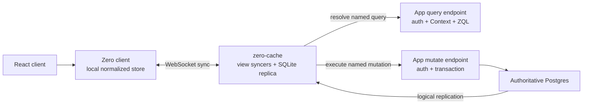

# Zero's current interface and stealable decisions

**Research snapshot:** 2026-07-20  
**Product status observed:** Zero 1.x; the current self-hosting guide uses the
`1.8.0` container, and Zero declares the product generally available as of March 2026.

## Executive answer

Zero is a query-driven client/server sync engine built around three application
interfaces: a schema, named queries, and named mutators.

- A browser-side Zero client keeps recently used rows in a normalized local
  store, normally IndexedDB.
- `zero-cache` maintains a SQLite replica of the syncable part of Postgres,
  updates it through logical replication, and maintains the server-side state of
  active client views.
- Named queries execute client-first, then hydrate and stay current from the
  server. The server can replace or narrow the client query using authenticated
  context.
- Named mutators execute client-first in a local transaction, are sent as a name
  plus arguments to an application-owned mutate endpoint, execute there in a
  Postgres transaction, and are reconciled when the authoritative database
  changes replicate back through `zero-cache`.
- The application still owns authentication, authorization, validation, and
  business rules. Zero owns the mutation/client-group bookkeeping, local query
  maintenance, and replication-driven reconciliation.

The old term **custom mutator** is now historical. Zero 0.25 unified its former
query and mutation variants; the current interface simply calls these
**mutators**. Showtime's Writers are closest to the shared deterministic body of
a mutator, while the descriptor union plus registry is closest to Zero's named
mutator registry.

## Topology

This is not “the browser writes to a cache which later writes to Postgres.” The
browser records an optimistic mutation locally; the application-owned mutate
endpoint is still the authoritative command handler. `zero-cache` observes the
accepted database result through logical replication and reconciles clients.

## The application interface

### 1. Schema

A Zero schema describes the syncable tables, columns, primary keys, and
relationships used by ZQL. It can be generated from Drizzle or Prisma or authored
manually.

The schema provides type safety and relationship metadata; Postgres remains the
storage schema. Schema evolution is an explicitly ordered three-party protocol:
Postgres, the API server, and clients. Expansion deploys providers before
consumers; contraction deploys consumers before providers. Incompatible clients
receive an update-needed signal and reload by default.

Relevant constraints:

- ZQL supports a subset of Postgres's types and features.
- Synced tables need usable keys.
- ZQL selects whole rows, not a column projection.
- Client-generated random string identifiers are recommended because the same
  identity must exist in the optimistic and authoritative executions.

Showtime already follows the last rule where a Writer needs to mint identities:
the equipment `add` descriptor carries an `idSeed`, and both sides derive the
same row ids from it.

### 2. Named queries

`defineQuery` combines an optional Standard Schema argument validator with a
function returning ZQL. `defineQueries` registers a nested set of query names.
Clients invoke the registered query, not arbitrary server ZQL.

The lifecycle is:

1. Run immediately against rows already present in the client store.
2. Send the query name and arguments to `zero-cache`.
3. Have `zero-cache` call the application's query endpoint.
4. Authenticate there, derive trusted `Context`, and return the authoritative
   ZQL expression for that caller.
5. Run that expression against the server replica and hydrate the client.
6. Incrementally update the active query as Postgres changes replicate.

The client interface exposes an important epistemic state:

- `unknown`: the local result may be partial.
- `complete`: the authoritative server result for this query has arrived.
- `error`: the query definition or arguments failed.

React uses `useQuery`. One-shot code uses `zero.run`, optionally waiting for a
`complete` result. `zero.preload` registers a query without materializing its
result into JavaScript. Active queries can remain cached for a bounded TTL after
their last consumer detaches.

This is a deeper interface than “subscribe to rows”: it tells the caller both
the current result and what is known about its completeness.

### 3. Named mutators

`defineMutator` combines an optional argument validator with an async function.
`defineMutators` registers the complete nested name space once. A client invokes
a registry member through `zero.mutate`; Zero sends the resulting mutator name
and arguments to the server.

A mutator receives:

- `args`: untrusted, validated arguments supplied by the caller;
- `ctx`: application-defined context, with the authoritative server value
  derived from validated credentials;
- `tx`: a transactional read/write interface;
- `tx.location`: `client` or `server`, when an implementation needs an explicit
  server-only branch.

Within the mutator:

- `tx.run(zql...)` reads the current transaction's data;
- `tx.mutate.<table>.insert/update/upsert/delete` writes through a typed CRUD
  interface;
- throwing aborts that mutation;
- server code can access the underlying database transaction for raw SQL;
- the server registry can extend or override the shared registry when authority
  needs additional checks or side effects.

The apparent symmetry has a strict limit: a client-side mutator can only read
data already cached locally; the server-side execution reads the authoritative
database. Consequently a shared mutator must either depend only on data known to
be cached, or tolerate a different optimistic result. Zero explicitly permits
client and server implementations to differ.

### 4. Mutation results and errors

Zero recommends fire-and-forget writes for the normal optimistic case, but
`zero.mutate(...)` also exposes separate promises for:

- client execution completing, and
- server acknowledgement completing.

Server acknowledgement does **not** imply that the resulting Postgres changes
have replicated back to this client yet. That is a third state. Current mutators
also cannot return an application success value from the server.

When one mutation throws in the standard handler, it is skipped, its optimistic
effect is reverted, and later mutations continue. Endpoint-level transport
failure has a different meaning: non-200/401/403 responses put the connection in
an error state; 401/403 puts it in `needs-auth`; reconnecting retries queued
mutations where applicable.

The separation between **optimistic application**, **server acceptance**, and
**authoritative projection catch-up** is one of the most useful concepts to steal.

## Reconciliation and conflict semantics

Zero's documented mutation lifecycle is server reconciliation:

1. Execute the mutation immediately against the local store.
2. Send its name and arguments to the mutate endpoint.
3. Execute the server mutator transactionally and record that it ran.
4. Replicate accepted Postgres changes to `zero-cache`.
5. Send changed rows plus information about applied mutations to clients.
6. Remove the accepted optimistic effects and update client queries from the
   authoritative rows; registered mutators remain available for conflict
   resolution while other mutations are pending.

The application supplies intent and deterministic behavior; Zero supplies the
ordered mutation/client-group bookkeeping and the continual authoritative base
updates. Application-level conflicts are still application decisions. A mutator
that sets an absolute value has different concurrent semantics from one that
applies a delta, just as it does in Showtime.

## Authentication, permissions, and client groups

The browser's `userID` is a storage and client-group key, **not proof of
identity**. The application must authenticate query and mutate requests, derive
the server `Context`, and pass the verified user id to Zero's handlers.

Tabs belonging to the same user can join a **client group** and share synced
data. The server-verified user id prevents a leaked or stolen client-group id
from joining a different user's group.

Current read permissions are query transformations:

- the server can add filters or return a query matching no rows;
- the client cannot submit arbitrary ZQL;
- the query endpoint can depend on ownership, role, membership, or other trusted
  context;
- auth can be periodically revalidated and query transformations periodically
  recomputed for out-of-band role or membership changes.

Current write permissions are ordinary server TypeScript inside mutators. The
server reads the relevant authoritative rows and refuses unauthorized
transitions.

Two security consequences matter for Showtime:

1. Zero normally persists per-user data in IndexedDB. Data can remain on a
   shared machine across logout unless the application calls `zero.delete()`.
   `kvStore: "mem"` avoids persistence at the cost of cold resyncs.
2. Current ZQL returns whole rows. Read permissions filter tables and rows;
   first-class column permissions are still roadmap work. Once a row is synced,
   its included columns are client data, not secrets hidden by UI code.

## Offline and connection behavior

Current Zero does **not** support offline writes.

- While `connecting`, reads work and writes may queue. This is intended to cover
  startup and short network/server interruptions.
- In `disconnected`, `error`, or `needs-auth`, cached reads continue but writes
  are rejected.
- Zero recommends disabling or covering write controls in those states.

This corrects an important initial premise for the spike. Zero can preserve
cached reads and smooth over brief connection gaps, but it does not buy a
durable, long-offline command log.

## Deployment and operational shape

Self-hosted `zero-cache` contains:

- one replication manager, which owns the upstream replication slot and SQLite
  replica; and
- one or more view syncers, which serve client queries and manage client-view
  records.

The minimum deployment co-locates those roles on one persistent node. The
documented production shape requires:

- a direct, non-pooler connection to the upstream Postgres replication stream;
- Postgres storage for client-view records and recent change data;
- a persistent SQLite replica file;
- a long-running WebSocket endpoint;
- graceful shutdown and health management;
- optional replica backup/restore for multi-node operation.

The query and mutate endpoints can remain in the existing Next.js application,
and Zero supports selecting Vercel preview endpoints through allowlisted URL
patterns. The stateful cache itself is nevertheless a separate data-plane
service (or a managed Cloud Zero deployment), not a Vercel Function.

### Neon consequence

Zero requires a logical replication subscriber. Neon documents that a compute
with an active logical replication subscriber does not scale to zero. This is a
direct consequence, not merely a suspicion: a continuously running Zero
replication manager keeps the publishing compute active.

Neon also removes inactive replication slots after roughly 40 hours and deletes
slots on branch restore. Those are recovery/operations concerns in addition to
the compute-cost change.

## React, Next.js, and RSC

Zero provides a client `ZeroProvider`, `useQuery`, and connection hooks. It also
provides Next.js examples for route handlers and provider setup. That makes Zero
usable in a Next.js app, but it is not the same as a first-class RSC read model:

- Zero's core read promise is client-first local query execution.
- Its current roadmap still lists SSR as future work.
- The server ZQL documentation describes direct server execution as groundwork
  that may support SSR in the future.

**Inference for Showtime:** adopting Zero for primary reads would require an
architectural choice, not just a provider wrapper. We would either move entity
surfaces toward client-owned queries, keep RSC for initial/secure projections
and run a second Zero read path after hydration, or limit Zero to selected
client islands. Each option creates an explicit synchronization seam with the
existing `LoadedCharacter` RSC base.

## The fog-of-war fit

Showtime's dungeon watch does not authorize by selecting a safe row. The server
loads the authoritative `mapInstance.state` JSON blob, then
`projectDungeonSnapshot` removes DM notes, undiscovered zones, unrevealed
connections, and other hidden state before any bytes reach the public client.

Synchronizing the `mapInstance` row itself through Zero would expose the whole
JSON value. Row filters cannot express “this viewer gets a projection of this
row,” and current ZQL has neither column selection nor first-class column
permissions. Even column permissions would not by themselves redact fields
inside one JSON column.

Safe options would require at least one of:

- keeping fogged snapshots outside Zero;
- materializing a separate, safe projection as its own authoritative rows;
- changing storage granularity so hidden and visible facts occupy separately
  permissioned rows; or
- proving a Zero query/mutator arrangement that never syncs the source row and
  cannot be bypassed.

The first option weakens the adoption case because Showtime would retain its
poll/ping/RSC reconciliation for one of its most realtime surfaces. The middle
options are data-model changes and must not be treated as integration details.

## What we could steal without Zero

The following are candidates for the comparison phase, not approved changes.

| Zero decision                                                              | Showtime today                                                                                                                     | Candidate lesson                                                                                                 |
| -------------------------------------------------------------------------- | ---------------------------------------------------------------------------------------------------------------------------------- | ---------------------------------------------------------------------------------------------------------------- |
| A complete named mutator registry shared by client and server              | The descriptor union, `ENTITY_WRITERS`, and exhaustive `applyEntityWrite` switch already form this registry                        | Name and document it as the mutation protocol interface; keep registration total and singular                    |
| Mutations carry intent and execute against each side's current transaction | Writers already receive intent descriptors; the server reloads authoritative components before applying them                       | Preserve delta/per-entry descriptors and reject client-composed aggregate post-state structurally                |
| Client-generated identities are part of mutation input                     | Equipment `add` carries an `idSeed`                                                                                                | Generalize the rule for every optimistic creation; never mint independently on the two sides                     |
| Optimistic, accepted, and projected are separate states                    | A Server Action result currently combines commit acknowledgement with a revalidated RSC response, while Ably handles other viewers | Make the three states explicit in documentation, diagnostics, and any future pending UI                          |
| Connection state is a product state                                        | Network failure currently appears per transition; Ably availability is mostly an implementation detail                             | Consider one honest read/write availability model before adding retries or offline UX                            |
| Query results carry completeness                                           | RSC loads are authoritative; polled snapshots separately expose `stale`                                                            | Reuse the epistemic distinction where a client can render cached/partial data, without importing ZQL             |
| Client groups coordinate tabs and bind them to verified identity           | Showtime queues are tab-local; Ably pings only invalidate other tabs                                                               | Study whether a small same-browser coordination primitive would solve a demonstrated problem before building one |
| Applied mutation bookkeeping is protocol state                             | The entity path has no durable client mutation id or deduplication record                                                          | Examine idempotency separately, especially for ambiguous network outcomes on additive descriptors                |
| Reconciliation continually updates active queries from changed rows        | Showtime emits advisory version pings and then refetches a whole route/snapshot                                                    | Look for narrower authoritative projections before building a general client database                            |
| Authenticated context is re-derived at server endpoints                    | Showtime already derives auth and storage home server-side                                                                         | Keep this; never let a shared optimistic function turn client context into authority                             |
| Server implementations may differ from client prediction                   | Restricted/narrative Archetype gates already live only at the entity door                                                          | Make divergence explicit and test the revert path; shared purity is a tool, not an authorization promise         |
| Schema compatibility has an expand/contract deployment protocol            | Showtime uses normal migrations and app deploys                                                                                    | Borrow the explicit three-party rollout thinking only if a persistent client schema is ever introduced           |

## What is probably not worth stealing now

- A normalized IndexedDB copy of entity state without a product need for cached
  reads.
- A general query language or active-query registry when RSC route loaders are
  already the natural authority.
- Cross-tab mutation queues without evidence that Ably invalidation plus
  server-side intent replay is insufficient.
- A second redaction model to fit the sync engine.
- Long-offline UX: current Zero does not provide it, and Showtime has not asked
  for it.

## Open questions for the comparison phase

1. Which current user-visible failures come from missing protocol machinery,
   rather than incorrect descriptor semantics?
2. Does any Showtime write need durable idempotency across an ambiguous network
   outcome?
3. Would separating commit acknowledgement from projection catch-up simplify
   pending/revert UI, or merely expose framework details?
4. Is same-browser cross-tab coordination valuable when server-side Writers
   already reapply intent against current state?
5. Can RSC remain the only initial read authority while a smaller client cache
   owns just one genuinely interactive surface?
6. Which realtime paths currently over-fetch enough to justify incremental row
   sync?
7. Is there any acceptable data model in which fog-safe facts are rows rather
   than a server projection—and would we choose that model without Zero?

## Primary sources

- [Zero introduction](https://zero.rocicorp.dev/docs/introduction)
- [Mutators](https://zero.rocicorp.dev/docs/mutators)
- [Queries](https://zero.rocicorp.dev/docs/queries)
- [ZQL](https://zero.rocicorp.dev/docs/zql)
- [Authentication and permission patterns](https://zero.rocicorp.dev/docs/auth)
- [Connection and offline behavior](https://zero.rocicorp.dev/docs/connection)
- [Schema and schema evolution](https://zero.rocicorp.dev/docs/schema)
- [Supported Postgres features](https://zero.rocicorp.dev/docs/postgres-support)
- [Self-hosting](https://zero.rocicorp.dev/docs/self-host)
- [Connecting to Postgres](https://zero.rocicorp.dev/docs/connecting-to-postgres)
- [Preview deployments](https://zero.rocicorp.dev/docs/previews)
- [When to use Zero](https://zero.rocicorp.dev/docs/when-to-use)
- [Project status](https://zero.rocicorp.dev/docs/status)
- [Zero 0.25 API unification](https://zero.rocicorp.dev/docs/release-notes/0.25)
- [Neon logical replication behavior](https://neon.com/docs/guides/logical-replication-neon)
